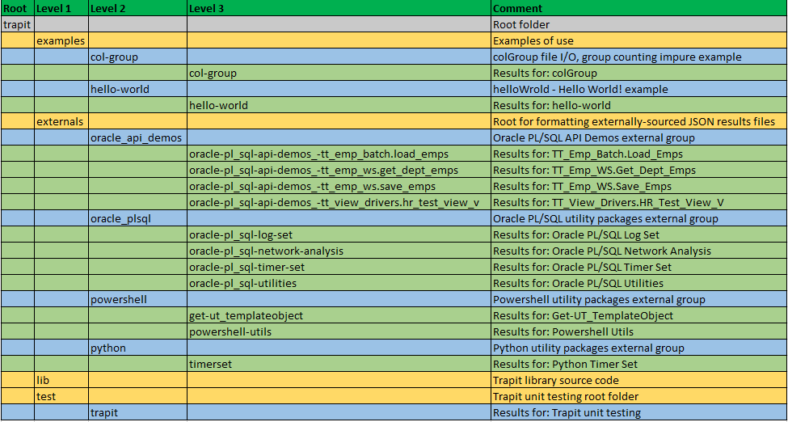

# Trapit


> The Math Function Unit Testing design pattern, implemented in nodejs

:detective:

This module supports a new design pattern for unit testing that can be applied in any language, and is here implemented in nodejs. The module name is derived from 'TRansactional API Testing' (TRAPIT), and the 'unit' should be considered to be a transactional unit (this is not micro-testing).

The Trapit module supports the full process for testing JavaScript programs, and, for non-JavaScript programs following the design pattern, formats the results by reading in a results object from a JSON file materialized by the external unit test program.

There are three short screen recordings on the module in the root folder:
- Trapit nodejs tester 1 - Overview.mp4
- Trapit nodejs tester 2 - Testing JavaScript programs.mp4
- Trapit nodejs tester 3 - Formatting external unit test results JSON files.mp4

These are also available in this [Twitter thread](https://twitter.com/BrenPatF/status/1419306890002059270).

There is a blog post on scenario selection in unit testing that may be of interest:

- [Unit Testing, Scenarios and Categories: The SCAN Method](https://brenpatf.github.io/jekyll/update/2021/10/17/unit-testing-scenarios-and-categories-the-scan-method.html)

## In this README...
[&darr; Background](https://github.com/BrenPatF/trapit_nodejs_tester#background)<br/>
[&darr; Usage 1 - JavaScript Unit Testing](https://github.com/BrenPatF/trapit_nodejs_tester#usage-1---javascript-unit-testing)<br/>
[&darr; Usage 2 - Formatting Unit Test Results for External Programs](https://github.com/BrenPatF/trapit_nodejs_tester#usage-2---formatting-test-results-for-external-programs)<br/>
[&darr; API](https://github.com/BrenPatF/trapit_nodejs_tester#api)<br/>
[&darr; Installation](https://github.com/BrenPatF/trapit_nodejs_tester#installation)<br/>
[&darr; Unit Testing](https://github.com/BrenPatF/trapit_nodejs_tester#unit-testing)<br/>
[&darr; Folder Structure](https://github.com/BrenPatF/trapit_nodejs_tester#folder-structure)<br/>
[&darr; See Also](https://github.com/BrenPatF/trapit_nodejs_tester#see-also)<br/>
[&darr; License](https://github.com/BrenPatF/trapit_nodejs_tester#license)

## Background
[&uarr; In this README...](https://github.com/BrenPatF/trapit_nodejs_tester#in-this-readme)

On March 23, 2018 I made the following presentation at the Oracle User Group conference in Dublin:

[Database API Viewed As A Mathematical Function: Insights into Testing](https://www.slideshare.net/brendanfurey7/database-api-viewed-as-a-mathematical-function-insights-into-testing)

The first section was summarised as:
<blockquote>Developing a universal design pattern for testing APIs using the concept of a 'pure' function as a wrapper to manage the 'impurity' inherent in database APIs</blockquote>

Although the presentation focussed on database testing the design pattern is clearly quite general.

The main features of the design pattern:

- The unit under test is viewed from the perspective of a mathematical function having an 'extended signature', comprising any actual parameters and return value, together with other inputs and outputs of any kind
- A wrapper function is constructed based on this conceptual function, and the wrapper function is 'externally pure', while internally handling impurities such as file I/O
- The wrapper function performs the steps necessary to test the UUT in a single scenario
- It takes all inputs of the extended signature as a parameter, creates any test data needed from them, effects a transaction with the UUT, and returns all outputs as a return value
- Any test data, and any data changes made by the UUT, are reverted before return
- The wrapper function specific to the UUT is called within a loop over scenarios by a library test driver module
- The library test driver module reads data for all scenarios in JSON format, with both inputs to the UUT and the expected outputs, and metadata records describing the specific data structure
- The module takes the actual outputs from the wrapper function and merges them in alongside the expected outputs to create an output results object
- This output results object is processed by the module to generate the results formatted as a summary page, with a detail page for each scenario, in both HTML and text versions

At a high level the design pattern:

- takes an input file containing all test scenarios with input data and expected output data for each scenario
- creates a results object based on the input file, but with actual outputs merged in
- uses the results object to generate unit test results files formatted in HTML and/or text


<br />

The Math Function Unit Testing design pattern is centred around the idea of a 'pure' wrapper function that maps from `extended` input parameters to an `extended`  return value, with both sides using a generic nested object structure.


<br />

Here is a diagram illustrating the concept of the 'externally pure' wrapper function:
<br /><br />

<br /><br />
The Trapit module supports the full process for testing JavaScript programs, and, for non-JavaScript programs, performs the formatting step by reading in the results object from a JSON file materialized by the external program. We'll show how this works in more detail diagrammatically in both cases here, with examples of use.
<br /><br />
Advantages of the design pattern include:

- Writing the unit test wrapper function is the only programming required for the specific unit test, with unit test driver, assertion and formatting all centralized in library packages
- Once the unit test wrapper function is written for one scenario, no further programming is required to handle additional scenarios, facilitating good scenario coverage
- The formatted results show exactly what the program does in terms of data inputs and outputs
- All unit test programs can follow a single, straightfoward pattern with minimal programming
- The nodejs Trapit module can be used to process results files generated from any language as JSON files (several examples are included with the project)

## Usage 1 - JavaScript Unit Testing
[&uarr; In this README...](https://github.com/BrenPatF/trapit_nodejs_tester#in-this-readme)<br/>
[&darr; JavaScript Example 1 - colGroup](https://github.com/BrenPatF/trapit_nodejs_tester#javascript-example-1---colgroup)<br/>
[&darr; JavaScript Example 2 - helloWorld](https://github.com/BrenPatF/trapit_nodejs_tester#javascript-example-2---helloworld)

In order to use the design pattern for unit testing, the following preliminary steps are required: 
- Create a JSON file containing the input test data including expected return values in the required format. The input JSON file essentially consists of two objects: 
  - `meta`: inp and out objects each containing group objects with arrays of field names
  - `scenarios`: scenario objects containing inp and out objects, with inp and out objects containing, for each group defined in meta, an array of input records and an array of expected output records, respectively, records being in delimited fields format
- Create a unit test script containing the wrapper function and a 1-line main section calling the Trapit library function, passing in the wrapper as a callback function. The wrapper function should call the unit under test passing the appropriate parameters and return its outputs, with the following signature:

  - Input parameter: 3-level list with test inputs as an object with groups as properties having 2-level arrays of record/field as values: {GROUP: [[String]], ...}
                        
  - Return Value:    2-level list with test outputs as an object with groups as properties having an array of records as delimited fields strings as value: {GROUP: [String], ...}

This wrapper function may need to write inputs to, and read outputs from, files or tables, but should be 'externally pure' in the sense that any changes made are rolled back before returning, including any made by the unit under test, and should be 'essentially' deterministic.

The diagram shows the flows between input and output files:

- Input JSON file (yellow)
- Formatted unit test reports (blue)

and the three code components, where the design pattern centralizes as much code as possible in the library package:

- Trapit library package (green)
- Specific test package (tan)
- Unit under test (rose)


Once the preliminary steps are executed, the script (test-uut.js, say) can be executed as follows:

```js
$ node [path]/test-uut
```

The script produces listings of the results in HTML and/or text format in a subfolder with name derived from the unit test title in the input JSON file.

### JavaScript Example 1 - colGroup
[&uarr; Usage 1 - JavaScript Unit Testing](https://github.com/BrenPatF/trapit_nodejs_tester#usage-1---javascript-unit-testing)<br/>
[&darr; Input JSON File](https://github.com/BrenPatF/trapit_nodejs_tester#input-json-file)<br/>
[&darr; Unit Test Wrapper Function](https://github.com/BrenPatF/trapit_nodejs_tester#unit-test-wrapper-function)<br/>
[&darr; Unit Test Scenarios](https://github.com/BrenPatF/trapit_nodejs_tester#unit-test-scenarios)

This example is a JavaScript class with a constructor function that reads in a CSV file and counts instances of distinct values in a given column. The constructor function appends a timestamp and call details to a log file. The class has methods to list the value/count pairs in several orderings. 

There is a main script that shows how the class might be called outside of unit testing:
```js
$ node examples/col-group/main-col-group
```
with output to console:
```
Counts sorted by (as is)
========================
Team         #apps
-----------  -----
team_name_2      1
team_name_1      1
West Brom     1219
Swansea       1180
Blackburn       33
Bolton          37
Chelsea       1147
Arsenal        534
Everton       1147
Tottenham     1288
Fulham        1209
QPR           1517
Liverpool     1227
Sunderland    1162
Man City      1099
Man Utd       1231
Newcastle     1247
Stoke City    1170
Wolves          31
Aston Villa    685
Wigan         1036
Norwich       1229
West Ham      1126
Reading       1167
...
```
and to log file, fantasy_premier_league_player_stats.csv.log:
```
Sun Sep 23 2018 13:29:07: File ./examples/col-group/fantasy_premier_league_player_stats.csv, delimiter ',', column 6
```


The example illustrates how a wrapper function can handle 'impure' features of the unit under test:
- Reading input from file
- Writing output to file

...and also how the JSON input file can allow for nondeterministic outputs giving rise to deterministic test outcomes:
- By using regex matching for strings including timestamps
- By using number range matching and converting timestamps to epochal offsets (number of units of time since a fixed time)

#### Input JSON File
[&uarr; JavaScript Example 1 - colGroup](https://github.com/BrenPatF/trapit_nodejs_tester#javascript-example-1---colgroup)<br/>
[&darr; col-group_temp.json](https://github.com/BrenPatF/trapit_nodejs_tester#col-group_tempjson)<br/>
[&darr; col-group.json](https://github.com/BrenPatF/trapit_nodejs_tester#col-groupjson)

The JSON input file contains `meta` and `scenarios` properties, as mentioned above, with structure reflecting the (extended) inputs and outputs of the unit under test. I like to make a diagram of the input and output groups, which for this example is:


An easy way to generate a starting point for the input JSON file is to use a powershell utility [Powershell Utilites module](https://github.com/BrenPatF/powershell_utils) to generate a template file with a single scenario with placeholder records from simple CSV files. The CSV files, `col-group_inp.csv`, containing input group, field pairs, and the second, `col-group_out.csv`, the same for output for the JSON structure diagram above would look like this:


The powershell utility can be run from a powershell window like this:

```powershell
Import-Module TrapitUtils
Write-UT_Template 'col-group' '|'
```

This generates the JSON template file, col-group_temp.json:

##### col-group_temp.json
[&uarr; Input JSON File](https://github.com/BrenPatF/trapit_nodejs_tester#input-json-file)

```json
{
  "meta": {
         "title": "title",
         "delimiter": "|",
         "inp": {
               "Log": [
                     "Line"
                   ],
               "Scalars": [
                       "Delimiter",
                       "Column#"
                     ],
               "Lines": [
                      "Line"
                    ]
             },
         "out": {
               "Log": [
                     "#Lines",
                     "Date Offset",
                     "Text"
                   ],
               "listAsIs": [
                       "#Instances"
                     ],
               "sortByKey": [
                        "Key",
                        "Value"
                      ],
               "sortByValue": [
                         "Key",
                         "Value"
                       ]
             }
       },
  "scenarios": {
           "scenario 1": {
                     "active_yn": "Y",
                     "inp": {
                           "Log": [
                                 ""
                               ],
                           "Scalars": [
                                   "|"
                                 ],
                           "Lines": [
                                  ""
                                ]
                         },
                     "out": {
                           "Log": [
                                 "||"
                               ],
                           "listAsIs": [
                                   ""
                                 ],
                           "sortByKey": [
                                    "|"
                                  ],
                           "sortByValue": [
                                     "|"
                                   ]
                         }
                   }
         }
}
```
The template is then updated with test data for 4 scenarios (showing just the first here):
##### col-group.json
[&uarr; Input JSON File](https://github.com/BrenPatF/trapit_nodejs_tester#input-json-file)

```json
{ "meta": {
    "title": "Col Group",
    "inp": {
        "Log": [
            "Line"
        ],
        "Scalars": [
            "Delimiter",
            "Column#"
        ],
        "Lines": [
            "Line"
        ]
    },
    "out": {
        "Log": [
            "#Lines",
            "Date Offset",
            "Text"
        ],
        "listAsIs": [
            "#Instances"
        ],
        "sortByKey": [
            "Key",
            "Value"
        ],
        "sortByValue": [
            "Key",
            "Value"
        ]
    }
},
"scenarios" : { 
   "Col 1/3; 2 duplicate lines; double-delimiter; 1-line log": 
   {
    "active_yn" : "Y",
    "inp": {
       "Log": [
       ],
       "Scalars": [
            ",|2"
        ],
        "Lines": [
            "0,1,Cc,3",
            "00,1,A,9",
            "000,1,B,27",
            "0000,1,A,81"
        ]
    },
    "out": {
        "Log": [
            "1|IN [0, 2000]|LIKE /.*: File ./examples/col-group/ut_group.csv, delimiter ',', column 2/"
        ],
        "listAsIs": [
            "3"
        ],
        "sortByKey": [
            "A|2",
            "Bx|1",
            "Cc|1"
        ],
        "sortByValue": [
            "B|1",
            "Cc|1",
            "A|2"
        ]
    }
},
...3 more scenarios
}}
```
Notice the syntax for the expected values for the second and third fields in the 3-field output record for the log group. This specifies matching against a numeric range and a regular expression, respectively, as follows:

- Date Offset: "IN [0, 2000]" - the datetime offset in microseconds must be between 0 and 2000 microseconds from the datetime at the start of execution
- Text: "LIKE /.*: File ./examples/col-group/ut_group.csv, delimiter ',', column 2/" - the line of text written must match the regular expression betwen the '/' delimiters, allowing us to ignore the precise timestamp for testing purposes, but still to display it for information


#### Unit Test Wrapper Function
[&uarr; JavaScript Example 1 - colGroup](https://github.com/BrenPatF/trapit_nodejs_tester#javascript-example-1---colgroup)

The text box below shows the entire specific unit test code for this example (short isn't it? 🙂) containing the pure wrapper function, purelyWrapUnit, and the one line main section calling the library function, Trapit.fmtTestUnit.

```js
const [ColGroup,                Trapit,            fs           ] =
      [require('./col-group'),  require('trapit'), require('fs')],
      [DELIM,                   ROOT,                  ] = 
      ['|',                     './examples/col-group/'];

const [INPUT_JSON,              INPUT_FILE,            LOG_FILE                 ] =
      [ROOT + 'col-group.json', ROOT + 'ut_group.csv', ROOT + 'ut_group.csv.log'];

const [GRP_LOG,   GRP_SCA,   GRP_LIN, GRP_LAI,    GRP_SBK,     GRP_SBV      ]  =
      ['Log',       'Scalars', 'Lines', 'listAsIs', 'sortByKey', 'sortByValue'];

function fromCSV(csv, col) {return csv.split(DELIM)[col]};
function joinTuple(t) {return t.join(DELIM)}

function setup(inp) {
  fs.writeFileSync(INPUT_FILE, inp[GRP_LIN].join('\n'));
  if (inp[GRP_LOG].length > 0) {
    fs.writeFileSync(LOG_FILE, inp[GRP_LOG].join('\n') + '\n');
  }
  return new ColGroup(INPUT_FILE, fromCSV(inp[GRP_SCA][0], 0), fromCSV(inp[GRP_SCA][0], 1));
}
function teardown() {
  fs.unlinkSync(INPUT_FILE);
  fs.unlinkSync(LOG_FILE);
}
function purelyWrapUnit(inpGroups) {
  const colGroup = setup(inpGroups);

  const linesArray = String(fs.readFileSync(LOG_FILE)).split('\n'),
        lastLine   = linesArray[linesArray.length - 2],
        text       = lastLine, //lastLine.substring(26),
        date       = lastLine.substring(0, 24),
        logDate    = new Date(date),
        now        = new Date(),
        diffDate   = now.getTime() - logDate.getTime();

  teardown();
  return {
    [GRP_LOG] : [(linesArray.length - 1) + DELIM + diffDate + DELIM + text],
    [GRP_LAI] : [colGroup[GRP_LAI]().length.toString()],
    [GRP_SBK] : colGroup[GRP_SBK]().map(joinTuple),
    [GRP_SBV] : colGroup[GRP_SBV]().map(joinTuple)
  };
}
Trapit.fmtTestUnit(INPUT_JSON, ROOT, purelyWrapUnit);
```

Calling this script, from, say, a Powershell window in the Trapit root folder generates the detailed results files in a subfolder.

```js
$ node ./examples/col-group/test-col-group
```

#### Unit Test Scenarios
[&uarr; JavaScript Example 1 - colGroup](https://github.com/BrenPatF/trapit_nodejs_tester#javascript-example-1---colgroup)<br/>
[&darr; Input Data Category Sets](https://github.com/BrenPatF/trapit_nodejs_tester#input-data-category-sets)<br/>
[&darr; Scenario Results](https://github.com/BrenPatF/trapit_nodejs_tester#scenario-results)

The art of unit testing lies in choosing a set of scenarios that will produce a high degree of confidence in the functioning of the unit under test across the often very large range of possible inputs.

A useful approach to this can be to think in terms of categories of inputs, where we reduce large ranges to representative categories. In our case we might consider the following category sets, and create scenarios accordingly:

##### Input Data Category Sets
[&uarr; Unit Test Scenarios](https://github.com/BrenPatF/trapit_nodejs_tester#unit-test-scenarios)<br/>
[&darr; Value Size (key)](https://github.com/BrenPatF/trapit_nodejs_tester#value-size-key)<br/>
[&darr; Multiplicity](https://github.com/BrenPatF/trapit_nodejs_tester#multiplicity)

###### Value Size (key)
[&uarr; Input Data Category Sets](https://github.com/BrenPatF/trapit_nodejs_tester#input-data-category-sets)

Check short string key values and long ones do not cause errors
- Short, 1 character
- Long, say 50 characters

###### Multiplicity
[&uarr; Input Data Category Sets](https://github.com/BrenPatF/trapit_nodejs_tester#input-data-category-sets)

Multiplicity is a very commonly applicable generic category set: programs often behave differently according to multiplicity of some variable, where zero is often an edge case, while 1 and more than 1 value may both need to be checked. Here we can consider its application to three variables:

Apply to:
<ul>
<ul>
<li>Delimiter (1 or multi-character, 2 say)</li>
<li>Key value (1-occurrence or multiple-occurrence key value, 2 say)</li>
<li>Lines (empty CSV file / no log file; or 1 or more lines)</li>
</ul>
</ul>

##### Scenario Results
[&uarr; Unit Test Scenarios](https://github.com/BrenPatF/trapit_nodejs_tester#unit-test-scenarios)<br/>
[&darr; Results Summary](https://github.com/BrenPatF/trapit_nodejs_tester#results-summary)<br/>
[&darr; Results for Scenario 1: Col 3/4; 4 lines; comma-delimiter; no log](https://github.com/BrenPatF/trapit_nodejs_tester#results-for-scenario-1-col-34-4-lines-comma-delimiter-no-log)

###### Results Summary
[&uarr; Scenario Results](https://github.com/BrenPatF/trapit_nodejs_tester#scenario-results)

As well as the results folder, the script also generates a summary of the unit test results to the console window:

```
Unit Test Results Summary for Folder ./examples/col-group/
==========================================================
File:          col-group.json
Title:         Col Group
Inp Groups:    3
Out Groups:    4
Tests:         4
Fails:         2
Folder:        col-group
```

It shows that there were two scenarios tested, both of which failed (deliberately). The full results listings are in the subfolder col-group in both text and HTML format. Here is the summary page in text format:

```
Unit Test Report: Col Group
===========================

      #    Scenario                                                                       Fails (of 4)  Status 
      ---  -----------------------------------------------------------------------------  ------------  -------
      1*   Col 3/4; 4 lines; comma-delimiter; no log                                      1             FAILURE
      2*   Col 1/3; 2 duplicate lines; double-delimiter; 1-line log                       1             FAILURE
      3    Col 10/10; 3 lines, 2 with same 50-character key; comma-delimiter; 1-line log  0             SUCCESS
      4    Col 10/10; empty file edge-case; comma-delimiter; 1-line log                   0             SUCCESS

Test scenarios: 2 failed of 4: FAILURE
======================================
```

###### Results for Scenario 1: Col 3/4; 4 lines; comma-delimiter; no log
[&uarr; Scenario Results](https://github.com/BrenPatF/trapit_nodejs_tester#scenario-results)

Here are the results for the first scenario in text format:

```
SCENARIO 1: Col 3/4; 4 lines; comma-delimiter; no log {
=======================================================

   INPUTS
   ======

      GROUP 1: Log: Empty
      ===================

      GROUP 2: Scalars {
      ==================

            #  Delimiter  Column#
            -  ---------  -------
            1  ,          2      

      }
      =

      GROUP 3: Lines {
      ================

            #  Line       
            -  -----------
            1  0,1,Cc,3   
            2  00,1,A,9   
            3  000,1,B,27 
            4  0000,1,A,81

      }
      =

   OUTPUTS
   =======

      GROUP 1: Log {
      ==============

            #  #Lines  Date Offset        Text                                                                                                                                                                 
            -  ------  -----------------  ---------------------------------------------------------------------------------------------------------------------------------------------------------------------
            1  1       IN [0, 2000]: 490  LIKE /.*: File ./examples/col-group/ut_group.csv, delimiter ',', column 2/: Sat Jul 10 2021 14:47:35: File ./examples/col-group/ut_group.csv, delimiter ',', column 2

      } 0 failed of 1: SUCCESS
      ========================

      GROUP 2: listAsIs {
      ===================

            #  #Instances
            -  ----------
            1  3         

      } 0 failed of 1: SUCCESS
      ========================

      GROUP 3: sortByKey {
      ====================

            #   Key  Value
            --  ---  -----
            1   A    2    
            2   Bx   1    
            2*  B    1    
            3   Cc   1    

      } 1 failed of 3: FAILURE
      ========================

      GROUP 4: sortByValue {
      ======================

            #  Key  Value
            -  ---  -----
            1  B    1    
            2  Cc   1    
            3  A    2    

      } 0 failed of 3: SUCCESS
      ========================

} 1 failed of 4: FAILURE
========================
```

Note the record #2 above marked with a '\*' in 'GROUP 3: sortByKey'. Where the actual value differs from expected the actual record is listed below the expected, with the '\*' marker against the record number, and in the HTML report the record is coloured red.

### JavaScript Example 2 - helloWorld
[&uarr; Usage 1 - JavaScript Unit Testing](https://github.com/BrenPatF/trapit_nodejs_tester#usage-1---javascript-unit-testing)<br/>
[&darr; Input JSON File](https://github.com/BrenPatF/trapit_nodejs_tester#input-json-file-1)<br/>
[&darr; Unit Test Wrapper Function](https://github.com/BrenPatF/trapit_nodejs_tester#unit-test-wrapper-function-1)<br/>
[&darr; Unit Test Scenarios](https://github.com/BrenPatF/trapit_nodejs_tester#unit-test-scenarios-1)

```js
module.exports = {
      helloWorld: () => {return 'Hello World!'}
}
```
This is a pure function form of Hello World program, returning a value rather than writing to screen itself. It is of course trivial, but has some interest as an edge case with no inputs and extremely simple JSON input structure and test code.

There is a main script that shows how the function might be called outside of unit testing:
```js
$ node examples/hello-world/main-hello-world
```
with output to console:
```
Hello World!
```
#### Input JSON File
[&uarr; JavaScript Example 2 - helloWorld](https://github.com/BrenPatF/trapit_nodejs_tester#javascript-example-2---helloworld)<br/>
[&darr; hello-world.json](https://github.com/BrenPatF/trapit_nodejs_tester#hello-worldjson)

The JSON structure diagram for this trivial example is:


The input JSON file, showing empty input property in the meta and scenarios objects, is:
##### hello-world.json
[&uarr; Input JSON File](https://github.com/BrenPatF/trapit_nodejs_tester#input-json-file-1)

```json
{ "meta": {
    "title": "Hello World",
    "inp": {},
    "out": {
        "Group": [
            "Greeting"
        ]
    }
},
"scenarios" : { 
   "Scenario": 
   {
    "inp": {},
    "out": {
        "Group": [
            "Hello World!"
        ]
    }
}
}}
```

#### Unit Test Wrapper Function
[&uarr; JavaScript Example 2 - helloWorld](https://github.com/BrenPatF/trapit_nodejs_tester#javascript-example-2---helloworld)

The text box below shows the entire specific unit test code for this example. In this trivial case, we can pass the pure wrapper function as a lambda expression.

```js
const [Trapit,                    Hw                      ] = 
      [require('trapit'),         require('./hello-world')],
      [ROOT,                      GROUP                   ] =
      ['./examples/hello-world/', 'Group'                 ];

const INPUT_JSON = ROOT + 'hello-world.json';

Trapit.fmtTestUnit(INPUT_JSON, ROOT, (inpGroups) => { return {[GROUP] : [Hw.helloWorld()]} });
```

Calling this script, from, say, a Powershell window in the Trapit root folder generates the detailed results files in a subfolder.

```js
$ node ./examples/hello-world/test-hello-world
```
#### Unit Test Scenarios
[&uarr; JavaScript Example 2 - helloWorld](https://github.com/BrenPatF/trapit_nodejs_tester#javascript-example-2---helloworld)<br/>
[&darr; Input Data Category Sets](https://github.com/BrenPatF/trapit_nodejs_tester#input-data-category-sets-1)<br/>
[&darr; Scenario Results](https://github.com/BrenPatF/trapit_nodejs_tester#scenario-results-1)

##### Input Data Category Sets
[&uarr; Unit Test Scenarios](https://github.com/BrenPatF/trapit_nodejs_tester#unit-test-scenarios-1)

With no input data, the set of input data category sets is of course empty 🙂.

##### Scenario Results
[&uarr; Unit Test Scenarios](https://github.com/BrenPatF/trapit_nodejs_tester#unit-test-scenarios-1)

As well as the results folder, the script also generates a summary of the unit test results to the console window:

```
Unit Test Results Summary for Folder ./examples/hello-world/
============================================================
File:          hello-world.json
Title:         Hello World
Inp Groups:    0
Out Groups:    1
Tests:         1
Fails:         0
Folder:        hello-world
```

It shows that there was one scenario tested, which succeeded. The full results listings are in the subfolder hello-world in both text and HTML format. Here is the full set of results in text format:

<pre>
Unit Test Report: Hello World
=============================

      #    Scenario  Fails (of 1)  Status 
      ---  --------  ------------  -------
      1    Scenario  0             SUCCESS

Test scenarios: 0 failed of 1: SUCCESS
======================================

SCENARIO 1: Scenario {
======================

   INPUTS
   ======

   OUTPUTS
   =======

      GROUP 1: Group {
      ================

            #  Greeting    
            -  ------------
            1  Hello World!

      } 0 failed of 1: SUCCESS
      ========================

} 0 failed of 1: SUCCESS
========================
</pre>

## Usage 2 - Formatting Test Results for External Programs
[&uarr; In this README...](https://github.com/BrenPatF/trapit_nodejs_tester#in-this-readme)<br/>
[&uarr; Results Summaries for External Folders](https://github.com/BrenPatF/trapit_nodejs_tester#results-summaries-for-external-folders)

For non-JavaScript programs tested using the Math Function Unit Testing design pattern, the results object is materialized using a library package in the relevant language. The diagram below shows how the processing is split into two steps:
- First, the output results object is created using the external library package in a similar way to the JavaScript processing, and is then written to a JSON file
- Second, a JavasScript script from the current project is run, passing in the name of the folder with the results JSON file(s)

This creates a subfolder for each JSON file with name based on the unit test title within the file, and also outputs a table of summary results for each file. The diagram below shows how in the first step the processing is split between three code units in a similar way to the JavaScript case:
- Test Unit: External library function that drives the unit testing with a callback to a specific wrapper function
- Specific Test Package: This has a 1-line main program to call the library driver function, passing in the callback wrapper function
- Unit Under Test: Called by the wrapper function, which converts between its specific inputs and outputs and the generic version used by the library package


In the second step the output results JSON file is read into an object by the Trapit library package, which then formats the results in exactly the same way as for JavaScript testing.

The following script (format-externals.js) can be used to execute the second step, passing as a parameter the name of a subfolder for the output JSON files, relative to the root folder specified in the script.

```js
const [ROOT,          subFolder,       Trapit           ] =
      ['./externals', process.argv[2], require('trapit')];

Trapit.tabMkUTExternalResultsFolders(ROOT + (subFolder === undefined ? '' : '/' + subFolder), 'B'); // H/T/B : Format in HTML/Text/Both
```

The script can be run from a Powershell window in the root trapit folder for a `subfolder` in the externals folder containing a set of JSON results files: 
```
$ node externals\format-externals subfolder
```

### Results Summaries for External Folders
[&uarr; Usage 2 - Formatting Test Results for External Programs](https://github.com/BrenPatF/trapit_nodejs_tester#usage-2---formatting-test-results-for-external-programs)<br/>
[&darr; oracle_api_demos](https://github.com/BrenPatF/trapit_nodejs_tester#oracle_api_demos)<br/>
[&darr; oracle_plsql](https://github.com/BrenPatF/trapit_nodejs_tester#oracle_plsql)<br/>
[&darr; powershell](https://github.com/BrenPatF/trapit_nodejs_tester#powershell)<br/>
[&darr; python](https://github.com/BrenPatF/trapit_nodejs_tester#python)


Here we give the top-level results summaries output to console for each of the groups of externally-sourced JSON files. Links to the source GitHub project are included for each group.

#### oracle_api_demos
[&uarr; Results Summaries for External Folders](https://github.com/BrenPatF/trapit_nodejs_tester#results-summaries-for-external-folders)<br/>
The results JSON file is sourced from the following GitHub project, and the formatted results files can be seen in the indicated subfolders:
- [Oracle PL/SQL API Demos - demonstrating instrumentation and logging, code timing and unit testing of Oracle PL/SQL APIs](https://github.com/BrenPatF/oracle_plsql_api_demos)

Running the format-externals script for subfolder oracle_api_demos from a Powershell window in the root trapit folder:
```
$ node externals\format-externals oracle_api_demos
```
gives the following output to console, as well as writing the results subfolders as indicated:
```
Unit Test Results Summary for Folder ./externals/oracle_api_demos
=================================================================
 File                                                 Title                                                    Inp Groups  Out Groups  Tests  Fails  Folder                                                 
----------------------------------------------------  -------------------------------------------------------  ----------  ----------  -----  -----  -------------------------------------------------------
 tt_emp_batch.purely_wrap_load_emps_out.json          Oracle PL/SQL API Demos: TT_Emp_Batch.Load_Emps                   5           5      9      0  oracle-pl_sql-api-demos_-tt_emp_batch.load_emps        
 tt_emp_ws.purely_wrap_get_dept_emps_out.json         Oracle PL/SQL API Demos: TT_Emp_WS.Get_Dept_Emps                  2           2      5      0  oracle-pl_sql-api-demos_-tt_emp_ws.get_dept_emps       
*tt_emp_ws.purely_wrap_save_emps_out.json             Oracle PL/SQL API Demos: TT_Emp_WS.Save_Emps                      1           4      4      1  oracle-pl_sql-api-demos_-tt_emp_ws.save_emps           
 tt_view_drivers.purely_wrap_hr_test_view_v_out.json  Oracle PL/SQL API Demos: TT_View_Drivers.HR_Test_View_V           2           2      4      0  oracle-pl_sql-api-demos_-tt_view_drivers.hr_test_view_v

1 externals failed, see ./externals/oracle_api_demos for scenario listings
tt_emp_ws.purely_wrap_save_emps_out.json
```

#### oracle_plsql
[&uarr; Results Summaries for External Folders](https://github.com/BrenPatF/trapit_nodejs_tester#results-summaries-for-external-folders)<br/>
The results JSON files are sourced from the following GitHub projects, and the formatted results files can be seen in the indicated subfolders:
- [Log_Set - Oracle logging module](https://github.com/BrenPatF/log_set_oracle)
- [Net_Pipe - Oracle PL/SQL network analysis module](https://github.com/BrenPatF/plsql_network)
- [Timer_Set - Oracle PL/SQL code timing module](https://github.com/BrenPatF/timer_set_oracle)
- [Utils - Oracle PL/SQL general utilities module](https://github.com/BrenPatF/oracle_plsql_utils)

Running the format-externals script for subfolder oracle_plsql from a Powershell window in the root trapit folder:
```
$ node externals\format-externals oracle_plsql
```
gives the following output to console, as well as writing the results subfolders as indicated:
```
Unit Test Results Summary for Folder ./externals/oracle_plsql
=============================================================
 File                                         Title                           Inp Groups  Out Groups  Tests  Fails  Folder                        
--------------------------------------------  ------------------------------  ----------  ----------  -----  -----  ------------------------------
 tt_log_set.purely_wrap_log_set_out.json      Oracle PL/SQL Log Set                    6           6     21      0  oracle-pl_sql-log-set         
 tt_net_pipe.purely_wrap_all_nets_out.json    Oracle PL/SQL Network Analysis           1           2      3      0  oracle-pl_sql-network-analysis
 tt_timer_set.purely_wrap_timer_set_out.json  Oracle PL/SQL Timer Set                  2           9      8      0  oracle-pl_sql-timer-set       
 tt_utils.purely_wrap_utils_out.json          Oracle PL/SQL Utilities                 15          16      4      0  oracle-pl_sql-utilities       

0 externals failed, see ./externals/oracle_plsql for scenario listings
```

#### powershell
[&uarr; Results Summaries for External Folders](https://github.com/BrenPatF/trapit_nodejs_tester#results-summaries-for-external-folders)<br/>
The results JSON file is sourced from the following GitHub project, and the formatted results files can be seen in the indicated subfolder:
- [Powershell utilities module](https://github.com/BrenPatF/powershell_utils)

Running the format-externals script for subfolder powershell from a Powershell window in the root trapit folder:
```
$ node externals\format-externals powershell
```
gives the following output to console, as well as writing the results subfolders as indicated:
```
Unit Test Results Summary for Folder ./externals/powershell
===========================================================
 File                             Title                  Inp Groups  Out Groups  Tests  Fails  Folder               
--------------------------------  ---------------------  ----------  ----------  -----  -----  ---------------------
 get_ut_template_object_out.json  Get-UT_TemplateObject           3           4     10      0  get-ut_templateobject
 ps_utils_out.json                Powershell Utils                7           6      6      0  powershell-utils     

0 externals failed, see ./externals/powershell for scenario listings
```

#### python
[&uarr; Results Summaries for External Folders](https://github.com/BrenPatF/trapit_nodejs_tester#results-summaries-for-external-folders)<br/>
The results JSON file is sourced from the following GitHub project, and the formatted results files can be seen in the indicated subfolder:
- [timerset_python - Python code timing module](https://github.com/BrenPatF/timerset_python)

Running the format-externals script for subfolder python from a Powershell window in the root trapit folder:
```
$ node externals\format-externals python
```
gives the following output to console, as well as writing the results subfolders as indicated:
```
Unit Test Results Summary for Folder ./externals/python
=======================================================
 File               Title     Inp Groups  Out Groups  Tests  Fails  Folder  
------------------  --------  ----------  ----------  -----  -----  --------
 timerset_out.json  timerset           2           8      7      0  timerset

0 externals failed, see ./externals/python for scenario listings
```

## API
[&uarr; In this README...](https://github.com/BrenPatF/trapit_nodejs_tester#in-this-readme)<br/>
[&darr; Trapit.testUnit(inpFile, root, purelyWrapUnit, formatType = 'B')](https://github.com/BrenPatF/trapit_nodejs_tester#trapittestunitinpfile-root-purelywrapunit-formattype--b)<br/>
[&darr; Trapit.fmtTestUnit(inpFile, root, purelyWrapUnit, formatType = 'B')](https://github.com/BrenPatF/trapit_nodejs_tester#trapitfmttestunitinpfile-root-purelywrapunit-formattype--b)<br/>
[&darr; Trapit.mkUTExternalResultsFolders(extFolder, formatType = 'B')](https://github.com/BrenPatF/trapit_nodejs_tester#trapitmkutexternalresultsfoldersextfolder-formattype--b)<br/>
[&darr; Trapit.tabMkUTExternalResultsFolders(extFolder, formatType = 'B')](https://github.com/BrenPatF/trapit_nodejs_tester#trapittabmkutexternalresultsfoldersextfolder-formattype--b)

```js
const Trapit = require('trapit');
```

### Trapit.testUnit(inpFile, root, purelyWrapUnit, formatType = 'B')
[&uarr; API](https://github.com/BrenPatF/trapit_nodejs_tester#api)

This is the base entry point for testing JavaAcript programs. It writes the output results folder and returns a value containing summary data for the unit test. It has the following parameters:

- `inpFile`: JSON input file
- `root`: root folder, where the results output files are to be written, in a subfolder with name based on the report title
- `purelyWrapUnit`: wrapper function, which calls the unit under test passing the appropriate parameters and returning its outputs, with the following signature:
  - Input parameter: 3-level list with test inputs as an object with groups as properties having 2-level arrays of record/field as values: {GROUP: [[String]], ...}
  - Return Value:    2-level list with test outputs as an object with groups as properties having an array of records as delimited fields strings as value: {GROUP: [String], ...}
- `formatType`: format type = H/T/B - Format in HTML/Text/Both; default 'B'
- `colors`: object with HTML heading colours; default {h1: '#FFFF00', h2: '#2AE6C1', h3: '#33F0FF', h4: '#7DFF33'}

and object return value with the following fields:
- `nTest`: number of test scenarios
- `nFail`: number of test scenarios that failed
- `status`: status = SUCCESS/FAIL
- `resFolder`: name of results subfolder
- `nInpGroups`: number of input groups
- `nOutGroups`: number of output groups
- `title`: unit test title

### Trapit.fmtTestUnit(inpFile, root, purelyWrapUnit, formatType = 'B')
[&uarr; API](https://github.com/BrenPatF/trapit_nodejs_tester#api)

This is a wrapper function that calls the base entry point Trapit.testUnit with the same parameters and prints its return object to console.

### Trapit.mkUTExternalResultsFolders(extFolder, formatType = 'B')
[&uarr; API](https://github.com/BrenPatF/trapit_nodejs_tester#api)

This is the base entry point for formatting results JSON files from external programs. It writes the output results folders for each file in the external folder, and returns a value containing unit test summary data for the JSON files as an array of objects. It has the following parameters:

- `extFolder`: external folder, where the results output files are to be written, in a subfolder with name based on the report title
- `formatType`: format type = H/T/B - Format in HTML/Text/Both; default 'B'
- `colors`: object with HTML heading colours; default {h1: '#FFFF00', h2: '#2AE6C1', h3: '#33F0FF', h4: '#7DFF33'}

and array return value with the following fields:
- `file`: JSON results file name
- `nTest`: number of test scenarios
- `nFail`: number of test scenarios that failed
- `status`: status = SUCCESS/FAIL
- `resFolder`: name of results subfolder
- `nInpGroups`: number of input groups
- `nOutGroups`: number of output groups
- `title`: unit test title

### Trapit.tabMkUTExternalResultsFolders(extFolder, formatType = 'B')
[&uarr; API](https://github.com/BrenPatF/trapit_nodejs_tester#api)

This is a wrapper function that calls the base entry point Trapit.mkUTExternalResultsFolders with the same parameters and prints its return array in tabular format to console.

## Installation
[&uarr; In this README...](https://github.com/BrenPatF/trapit_nodejs_tester#in-this-readme)

With [npm](https://npmjs.org/) installed, run

```
$ npm install trapit 
```
## Unit Testing
[&uarr; In this README...](https://github.com/BrenPatF/trapit_nodejs_tester#in-this-readme)<br/>
[&darr; Wrapper Function Extended Signature](https://github.com/BrenPatF/trapit_nodejs_tester#wrapper-function-extended-signature)<br/>
[&darr; Unit Test Scenarios](https://github.com/BrenPatF/trapit_nodejs_tester#unit-test-scenarios-2)

The package itself is tested using the Math Function Unit Testing design pattern. A 'pure' wrapper function is constructed that takes input parameters and returns a value, and is tested within a loop over scenario records read from a JSON file.

In this case, the pure function getUTResults is unit tested explicitly, while the function Test-Unit is called as the main section of the unit test script, test-trapit.js.

The program is data-driven from the input file trapit.json and produces listings of the results in HTML and/or text format.

To run the unit test program, open a powershell window in the test folder and run:
```
$ npm test
```
This creates a subfolder trapit in the test folder with text results in trapit.txt, the HTML results summary file, trapit.html, and a separate HTML file for each scenario linked to in the summary file.

[An easy way to generate a starting point for the input JSON file is to use a powershell utility [Powershell Utilites module](https://github.com/BrenPatF/powershell_utils) to generate a template file with a single scenario with placeholder records from simple .csv files. See the script trapit.ps1 in the `test` subfolder for an example]

### Wrapper Function Extended Signature
[&uarr; Unit Testing](https://github.com/BrenPatF/trapit_nodejs_tester#unit-testing)


### Unit Test Scenarios
[&uarr; Unit Testing](https://github.com/BrenPatF/trapit_nodejs_tester#unit-testing)<br/>
[&darr; Input Data Category Sets](https://github.com/BrenPatF/trapit_nodejs_tester#input-data-category-sets-2)<br/>
[&darr; Scenario Results](https://github.com/BrenPatF/trapit_nodejs_tester#scenario-results-2)

#### Input Data Category Sets
[&uarr; Unit Test Scenarios](https://github.com/BrenPatF/trapit_nodejs_tester#unit-test-scenarios-2)<br/>
[&darr; Multiplicity](https://github.com/BrenPatF/trapit_nodejs_tester#multiplicity-1)<br/>
[&darr; Test Status](https://github.com/BrenPatF/trapit_nodejs_tester#test-status)<br/>
[&darr; Match Type](https://github.com/BrenPatF/trapit_nodejs_tester#match-type)<br/>
[&darr; Exception](https://github.com/BrenPatF/trapit_nodejs_tester#exception)

The art of unit testing lies in choosing a set of scenarios that will produce a high degree of confidence in the functioning of the unit under test across the often very large range of possible inputs.

A useful approach to this can be to think in terms of categories of inputs, where we reduce large ranges to representative categories. In our case we might consider the following category sets, and create scenarios accordingly:

##### Multiplicity
[&uarr; Input Data Category Sets](https://github.com/BrenPatF/trapit_nodejs_tester#input-data-category-sets-2)

Input and output sections are split into groups, and we should check the zero edge cases as well as 1 and multiple groups in each section. Similarly there may be zero or more records in each type of group, and 1 or more fields in each type of group.
- 0
- 1
- Multiple

Apply to:
<ul>
<ul>
<li>Input Groups</li>
<li>Output Groups</li>
<li>Input Group Records</li>
<li>Output Group Records</li>
<li>Input Group Fields (1 or multiple only)</li>
<li>Output Group Fields (1 or multiple only)</li>
</ul>
</ul>

##### Test Status
[&uarr; Input Data Category Sets](https://github.com/BrenPatF/trapit_nodejs_tester#input-data-category-sets-2)

Check both passing and failing tests processed correctly.
- Pass
- Fail

##### Match Type
[&uarr; Input Data Category Sets](https://github.com/BrenPatF/trapit_nodejs_tester#input-data-category-sets-2)

Values may have exact matching specified, or inexact, with regular expression matching for strings and ranges for numbers, and both types of matching should be checked for both data types. Null values may cause incorrect matching and this can also be checked.
- Exact match - string
- Inexact match - string
- Exact match - number
- Inexact match - number (not null actual)
- Inexact match - number (null actual)

##### Exception
[&uarr; Input Data Category Sets](https://github.com/BrenPatF/trapit_nodejs_tester#input-data-category-sets-2)

There can be a mismatch in the number of groups or of fields within a group between the metadata and the scenarios section, caused by a programming error, and it is desired to return an easy to understand exception in these cases.
- Group number mismatch
- Fields number mismatch

#### Scenario Results
[&uarr; Unit Test Scenarios](https://github.com/BrenPatF/trapit_nodejs_tester#unit-test-scenarios-2)<br/>
[&darr; Results Summary](https://github.com/BrenPatF/trapit_nodejs_tester#results-summary-1)<br/>
[&darr; Results for Scenario 1: No inp, 1 out group - simple edge-case - Passing](https://github.com/BrenPatF/trapit_nodejs_tester#results-for-scenario-1-no-inp-1-out-group---simple-edge-case---passing)

##### Results Summary
- [&uarr; Scenario Results](https://github.com/BrenPatF/trapit_nodejs_tester#scenario-results-2)

The summary report in text format shows the scenarios tested:

      #    Scenario                                                                                        Fails (of 5)  Status 
      ---  ----------------------------------------------------------------------------------------------  ------------  -------
      1    No inp, 1 out group - simple edge-case - Passing                                                0             SUCCESS
      2    1 inp, no out group - simple edge-case - Passing                                                0             SUCCESS
      3    No inp, 1 out group - null value in number range bug fix - should fail                          0             SUCCESS
      4    2 inp/out groups - 1-field/2-field groups; empty/non-empty groups; non-exact matches - Passing  0             SUCCESS
      5    2 inp/out groups - 1-field/2-field groups; empty/non-empty groups; non-exact matches - Failing  0             SUCCESS
      6    No inp, 1 out group - fields mismatch - Exception                                               0             SUCCESS
      7    No inp, 1 out group - groups mismatch - Exception                                               0             SUCCESS

##### Results for Scenario 1: No inp, 1 out group - simple edge-case - Passing
- [&uarr; Scenario Results](https://github.com/BrenPatF/trapit_nodejs_tester#scenario-results-2)

<pre>
SCENARIO 1: No inp, 1 out group - simple edge-case - Passing {
==============================================================

   INPUTS
   ======

      GROUP 1: Report {
      =================

            #  Title                
            -  ---------------------
            1  Hello World Edge Case

      }
      =

      GROUP 2: Input Fields: Empty
      ============================

      GROUP 3: Output Fields {
      ========================

            #  Group                 Field 
            -  --------------------  ------
            1  1-field output group  Single

      }
      =

      GROUP 4: Input Values: Empty
      ============================

      GROUP 5: Expected Values {
      ==========================

            #  Scenario             Group                 Row CSV     
            -  -------------------  --------------------  ------------
            1  No inp, 1 out group  1-field output group  Hello World!

      }
      =

      GROUP 6: Actual Values {
      ========================

            #  Scenario             Group                 Row CSV     
            -  -------------------  --------------------  ------------
            1  No inp, 1 out group  1-field output group  Hello World!

      }
      =

   OUTPUTS
   =======

      GROUP 1: Summaries {
      ====================

            #  Type          Scenario             Group                 Header 1                                 Header 2        Footer                                  # Records  # Fails  Status 
            -  ------------  -------------------  --------------------  ---------------------------------------  --------------  --------------------------------------  ---------  -------  -------
            1  Report                                                   Unit Test Report: Hello World Edge Case                  Test scenarios: 0 failed of 1: SUCCESS  1          0        SUCCESS
            2  Scenario      No inp, 1 out group                        SCENARIO 1: No inp, 1 out group          INPUTS-OUTPUTS  0 failed of 1: SUCCESS                  1          0        SUCCESS
            3  Output group  No inp, 1 out group  1-field output group  GROUP 1: 1-field output group                            0 failed of 1: SUCCESS                  1          0        SUCCESS

      } 0 failed of 3: SUCCESS
      ========================

      GROUP 2: Input Fields: Empty as expected: SUCCESS
      =================================================

      GROUP 3: Output Fields {
      ========================

            #  Scenario             Group                 Name    Length
            -  -------------------  --------------------  ------  ------
            1  No inp, 1 out group  1-field output group  #       1     
            2  No inp, 1 out group  1-field output group  Single  12    

      } 0 failed of 2: SUCCESS
      ========================

      GROUP 4: Input Values: Empty as expected: SUCCESS
      =================================================

      GROUP 5: Output Values {
      ========================

            #  Scenario             Group                 Row CSV       
            -  -------------------  --------------------  --------------
            1  No inp, 1 out group  1-field output group  1~Hello World!

      } 0 failed of 1: SUCCESS
      ========================

} 0 failed of 5: SUCCESS
========================
</pre>

You can review the formatted unit test results here, [Unit Test Report: Trapit](http://htmlpreview.github.io/?https://github.com/BrenPatF/trapit_nodejs_tester/blob/master/test/trapit/trapit.html), and the files are available in the `test/trapit` subfolder [trapit.html is the root page for the HTML version and trapit.txt has the results in text format].

## Folder Structure
[&uarr; In this README...](https://github.com/BrenPatF/trapit_nodejs_tester#in-this-readme)

The project folder structure is shown below.

There are four subfolders below the trapit root folder:
- `examples`: Two working JavaScript examples are included in their own subfolders, with both test scripts and a main script that shows how the unit under test would normally be called
- `externals`: Root folder for the examples provided of formatting externally-sourced results JSON files. These files all come from other GitHub projects with links given in the section `Results Summaries for External Folders` above. These are grouped into subfolders which can be extended as desired
- `lib`: This holds the project source code
- `test`: Root folder for unit testing of the Trapit project itself, with subfolder having the results files


## See Also
[&uarr; In this README...](https://github.com/BrenPatF/trapit_nodejs_tester#in-this-readme)
- [Database API Viewed As A Mathematical Function: Insights into Testing](https://www.slideshare.net/brendanfurey7/database-api-viewed-as-a-mathematical-function-insights-into-testing)
- [timer-set - JavaScript code timing module)](https://github.com/BrenPatF/timer-set-nodejs)
- [timerset_python - Python code timing module](https://github.com/BrenPatF/timerset_python)
- [Powershell utilities module](powershell_utils)
- [Utils - Oracle PL/SQL general utilities module](https://github.com/BrenPatF/oracle_plsql_utils)
- [Log_Set - Oracle logging module](https://github.com/BrenPatF/log_set_oracle)
- [Timer_Set - Oracle PL/SQL code timing module](https://github.com/BrenPatF/timer_set_oracle)
- [Net_Pipe - Oracle PL/SQL network analysis module](https://github.com/BrenPatF/plsql_network)
- [Trapit - Oracle PL/SQL unit testing module](https://github.com/BrenPatF/trapit_oracle_tester)
- [Oracle PL/SQL API Demos - demonstrating instrumentation and logging, code timing and unit testing of Oracle PL/SQL APIs](https://github.com/BrenPatF/oracle_plsql_api_demos)

## License
[&uarr; In this README...](https://github.com/BrenPatF/trapit_nodejs_tester#in-this-readme)

MIT