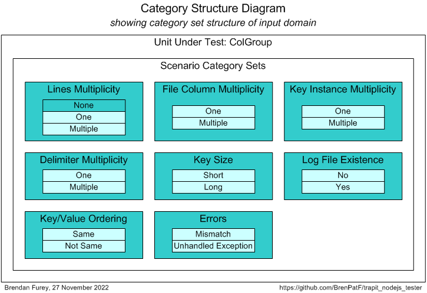
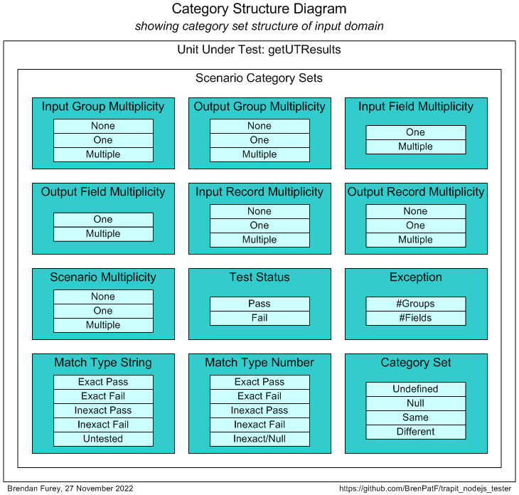

# Trapit - JavaScript Unit Testing/Formatting Utilities Module


> The Math Function Unit Testing design pattern, implemented in JavaScript

:detective: :hammer_and_wrench:

This module supports [The Math Function Unit Testing Design Pattern](https://brenpatf.github.io/2023/06/05/the-math-function-unit-testing-design-pattern.html), a  design pattern that can be applied in any language, and is here implemented in JavaScript. The module name is derived from 'TRansactional API Testing' (TRAPIT), and the 'unit' should be considered to be a transactional unit. The pattern avoids microtesting, is data-driven, and fully supports multi-scenario testing and refactoring.

The JavaScript Trapit module supports the complete process for testing JavaScript programs, and, for non-JavaScript programs following the pattern, formats the results by reading in a results object from a JSON file materialized by the external unit test program.

There is also a PowerShell module, [Trapit - PowerShell Unit Testing Utilities Module](https://github.com/BrenPatF/powershell_utils/tree/master/TrapitUtils) with a utility to generate a template for the JSON input file used by the design pattern, based on simple input CSV files.

This blog post, [Unit Testing, Scenarios and Categories: The SCAN Method](https://brenpatf.github.io/2021/10/17/unit-testing-scenarios-and-categories-the-scan-method.html) provides guidance on effective selection of scenarios for unit testing.

There is an extended Usage section below that illustrates the use of the design pattern for JavaScript unit testing by means of two examples. In addition, one of the main unit test formatting functions is tested using the design pattern.

# In This README...
[&darr; Background](#background)<br />
[&darr; Usage 1 - JavaScript Unit Testing](#usage-1---javascript-unit-testing)<br />
[&darr; Usage 2 - Formatting Test Results for External Programs](#usage-2---formatting-test-results-for-external-programs)<br />
[&darr; API](#api)<br />
[&darr; Installation](#installation)<br />
[&darr; Unit Testing](#unit-testing)<br />
[&darr; Folder Structure](#folder-structure)<br />
[&darr; See Also](#see-also)<br />
## Background
[&uarr; In This README...](#in-this-readme)<br />

I explained the concepts for the unit testing design pattern in relation specifically to database testing in a presentation at the Oracle User Group Ireland Conference in March 2018:

- [The Database API Viewed As A Mathematical Function: Insights into Testing](https://www.slideshare.net/brendanfurey7/database-api-viewed-as-a-mathematical-function-insights-into-testing)

I later named the approach [The Math Function Unit Testing Design Pattern](https://brenpatf.github.io/2023/06/05/the-math-function-unit-testing-design-pattern.html) when I applied it in Javascript and wrote a JavaScript program to format results both in plain text and as HTML pages:
- [Trapit - JavaScript Unit Testing/Formatting Utilities Module](https://github.com/BrenPatF/trapit_nodejs_tester)

The module also allowed for the formatting of results obtained from testing in languages other than JavaScript by means of an intermediate output JSON file. In 2021 I developed a PowerShell module that included a utility to generate a template for the JSON input scenarios file required by the design pattern:
- [Trapit - PowerShell Unit Testing Utilities Module](https://github.com/BrenPatF/powershell_utils/tree/master/TrapitUtils)

Also in 2021 I developed a systematic approach to the selection of unit test scenarios:
- [Unit Testing, Scenarios and Categories: The SCAN Method](https://brenpatf.github.io/2021/10/17/unit-testing-scenarios-and-categories-the-scan-method.html)

In early 2023 I extended both the the JavaScript results formatter, and the PowerShell utility to incorporate Category Set as a scenario attribute. Both utilities support use of the design pattern in any language, while the unit testing driver utility is language-specific and is currently available in PowerShell, JavaScript, Python and Oracle PL/SQL versions.
## Usage 1 - JavaScript Unit Testing
[&uarr; In This README...](#in-this-readme)<br />
[&darr; General Usage](#general-usage)<br />
[&darr; Example 1 - HelloWorld](#example-1---helloworld)<br />
[&darr; Example 2 - ColGroup](#example-2---colgroup)<br />

As noted above, the JavaScript module allows for unit testing of JavaScript programs and also the formatting of test results for both JavaScript and non-JavaScript programs. Similarly, the PowerShell module mentioned allows for unit testing of PowerShell programs, and also the generation of the JSON input scenarios file template for testing in any language.

In this section we'll start by describing the steps involved in [The Math Function Unit Testing Design Pattern](https://brenpatf.github.io/2023/06/05/the-math-function-unit-testing-design-pattern.html) at an overview level. This will show how the generic PowerShell and JavaScript utilities fit in alongside the language-specific driver utilities.

Then we'll show how to use the design pattern in unit testing JavaScript programs, first in general, and then by means of two simple examples.

### General Usage
[&uarr; Usage 1 - JavaScript Unit Testing](#usage-1---javascript-unit-testing)<br />
[&darr; General Description](#general-description)<br />
[&darr; Unit Testing Process](#unit-testing-process)<br />
[&darr; Unit Test Results](#unit-test-results)<br />

At a high level [The Math Function Unit Testing Design Pattern](https://brenpatf.github.io/2023/06/05/the-math-function-unit-testing-design-pattern.html) involves three main steps:

1. Create an input file containing all test scenarios with input data and expected output data for each scenario, as well as metadata describing the structure
2. Create a results object based on the input file, but with actual outputs merged in, based on calls to the unit under test
3. Use the results object to generate unit test results files formatted in HTML and/or text


<br />

#### General Description
[&uarr; General Usage](#general-usage)<br />

The first and third of these steps are supported by generic utilities that can be used in unit testing in any language. The second step uses a language-specific unit test driver utility.

For JavaScript programs tested using the Math Function Unit Testing design pattern, the results object is created within the JavaScript library package. The diagram below shows the flow of processing triggered by the specific test package main function:
- First, the output results object is created by the Test Unit library function
- Second, the function calls another function to format the results in HTML and/or text files

This creates a subfolder with name based on the unit test title within the input JSON file, and also outputs a table of summary results. The processing is split between three code units:
- Trapit library package with Test Unit function that drives the unit testing with a callback to a specific wrapper function, then calls the Format Results function to do the formatting
- Specific Test Package: This has a 1-line main program to call the library driver function, passing in the callback wrapper function
- Unit Under Test (API): Called by the wrapper function, which converts between its specific inputs and outputs and the generic version used by the library package


#### Unit Testing Process
[&uarr; General Usage](#general-usage)<br />
[&darr; Step 1: Create Input Scenarios File](#step-1-create-input-scenarios-file)<br />
[&darr; Step 2: Create Results Object](#step-2-create-results-object)<br />
[&darr; Step 3: Format Results](#step-3-format-results)<br />

This section details the three steps involved in following [The Math Function Unit Testing Design Pattern](https://brenpatf.github.io/2023/06/05/the-math-function-unit-testing-design-pattern.html).

##### Step 1: Create Input Scenarios File
[&uarr; Unit Testing Process](#unit-testing-process)<br />
[&darr; Unit Test Wrapper Function](#unit-test-wrapper-function)<br />
[&darr; Scenario Category ANalysis (SCAN)](#scenario-category-analysis-scan)<br />
[&darr; Creating the Input Scenarios File](#creating-the-input-scenarios-file)<br />

Step 1 requires analysis to determine the extended signature for the unit under test, and to determine appropriate scenarios to test.

It may be useful during the analysis phase to create two diagrams, one for the extended signature:
- JSON Structure Diagram: showing the groups with their fields for input and output

and another for the category sets and categories:
- Category Structure Diagram: showing the category sets identified with their categories

You can see examples of these diagrams later in this document, eg: [JSON Structure Diagram](#unit-test-wrapper-function-2) and [Category Structure Diagram](#scenario-category-analysis-scan-2), and schematic versions in the next two subsections.

###### Unit Test Wrapper Function
[&uarr; Step 1: Create Input Scenarios File](#step-1-create-input-scenarios-file)<br />

Here is a schematic version of a JSON structure diagram, which in a real instance will  in general have multiple input and output groups, each with multiple fields:


Each group in the diagram corresponds to a property within the inpGroups input object or outGroups return value object of the wrapper function, and contains an array of the group records, stored as delimited strings.

```js
function purelyWrapUnit(inpGroups) { // input groups object
    ...
    return outGroups;
}
```

###### Scenario Category ANalysis (SCAN)
[&uarr; Step 1: Create Input Scenarios File](#step-1-create-input-scenarios-file)<br />

The art of unit testing lies in choosing a set of scenarios that will produce a high degree of confidence in the functioning of the unit under test across the often very large range of possible inputs.

A useful approach can be to think in terms of categories of inputs, where we reduce large ranges to representative categories, an idea I explore in this article:

- [Unit Testing, Scenarios and Categories: The SCAN Method](https://brenpatf.github.io/2021/10/17/unit-testing-scenarios-and-categories-the-scan-method.html)

Here is a schematic version of a category set diagram, which in a real instance will in general have multiple category sets, each with multiple categories:


Each category i-j in the diagram corresponds to a scenario j for category set i.

###### Creating the Input Scenarios File
[&uarr; Step 1: Create Input Scenarios File](#step-1-create-input-scenarios-file)<br />

The results of the analysis can be summarised in three CSV files which a PowerShell program uses as inputs to create a template for the JSON file.

The PowerShell API, `Write-UT_Template` creates a template for the JSON file, with the full meta section, and a set of template scenarios having name as scenario key, a category set attribute, and zero or more records with default values for each input and output group. The API takes as inputs three CSV files:
  - `stem`\_inp.csv: list of group, field, values tuples for input
  - `stem`\_out.csv: list of group, field, values tuples for output
  - `stem`\_sce.csv: scenario triplets - (Category set, scenario name, active flag); this file is optional

In the case where a scenarios file is present, each group has zero or more records with field values taken from the group CSV files, with a record for each value column present where at least one value is not null for the group. The template scenario represents a kind of prototype scenario, where records may be manually updated (and added or subtracted) to reflect input and expected output values for the actual scenario being tested.

The API can be run with the following PowerShell in the folder of the CSV files:

###### Format-JSON-Stem.ps1
```powershell
Import-Module TrapitUtils
Write-UT_Template 'stem' '|' 'title'
```
This creates the template JSON file, `stem`\_temp.json based on the CSV files having prefix `stem` and using the field delimiter '|', and including the unit test title passed. The PowerShell API can be used for testing in any language.

The template file is then updated manually with data appropriate to each scenario.

##### Step 2: Create Results Object
[&uarr; Unit Testing Process](#unit-testing-process)<br />

Step 2 requires the writing of a wrapper function that is passed into a unit test library function, testUnit, via the entry point API,  `fmtTestUnit`. testUnit reads the input JSON file, calls the wrapper function for each scenario, and creates the output object with the actual results merged in along with the expected results.

In scripting languages, such as JavaScript or Python, there will be a driving script containing the wrapper function definition, followed by a one-line call to the driver API in a library module. In a database language, such as Oracle PL/SQL the wrapper function would be in a stored package, and called by the driver API internally depending on a parameter passed.

In the JavaScript version of the unit test driver API, the object is used directly to create the formatted HTML and text results files; in non-JavaScript versions the object is written to file to be read by the JavaScript formatter in a separate step.

##### purelyWrapUnit
```js
function purelyWrapUnit(inpGroups) { // input groups object
    ...
    return {
        ...
    }
}
```

The test driver API,  `fmtTestUnit`, is language-specific, and this one is for testing JavaScript programs. Equivalents exist under the same GitHub account (BrenPatF) for Python, PowerShell and Oracle PL/SQL at present.

##### Step 3: Format Results
[&uarr; Unit Testing Process](#unit-testing-process)<br />

Step 3 involves formatting the results contained in the output object from step 2.

- fmtTestUnit is the function from the Trapit JavaScript package that calls the main test driver function, testUnit, that contains the wrapper function, then passes the output object to the formatter and outputs a summary of the results.  It takes as parameters:

    - `inpFile`: input JSON file name
    - `root`: unit test root folder
    - `purelyWrapUnit`: function to process unit test for a single scenario
    - `formatType`: type of output ('H' = HTML, 'T' = text, 'B' = both: default)
    - `colors`: object with colours to use in HTML formatting, with default

    with return value:

    - summary of results

###### test-uut.js
The test driver script defines the wrapper function, and passes it into the entry point Trapit library API.
```js
const Trapit = require('trapit');
function purelyWrapUnit(inpGroups) { // input groups object
    ...
    return {
        ...
    }
}
Trapit.fmtTestUnit(INPUT_JSON, ROOT, purelyWrapUnit);
```

#### Unit Test Results
[&uarr; General Usage](#general-usage)<br />
[&darr; Unit Test Report - Scenario List](#unit-test-report---scenario-list)<br />
[&darr; Unit Test Report - Scenario Pages](#unit-test-report---scenario-pages)<br />

The script above creates a results subfolder, with results in text and HTML formats, in the script folder, and outputs a summary of the following form:

```
Results summary for file: [MY_PATH]/stem_out.json
=================================================

File:          stem_out.json
Title:         [Title]
Inp Groups:    [#Inp Groups]
Out Groups:    [#Out Groups]
Tests:         [#Tests]
Fails:         [#Fails]
Folder:        [Folder]
```

Within the results subfolder there is a text file containing a list of summary results at scenario level, followed by the detailed results for each scenario. In addition there are files providing the results in HTML format.

##### Unit Test Report - Scenario List
[&uarr; Unit Test Results](#unit-test-results)<br />

The scenario list page lists, for each scenario:

- \# - the scenario index
- Category Set - the category set applying to the scenario
- Scenario - a description of the scenario
- Fails (of N) - the number of groups failing, with N being the total number of groups
- Status - SUCCESS or FAIL

The scenario field is a hyperlink to the individual scenario page.

##### Unit Test Report - Scenario Pages
[&uarr; Unit Test Results](#unit-test-results)<br />

The page for each scenario has the following schematic structure:
```
SCENARIO i: Scenario [Category Set: (category set)]
  INPUTS
    For each input group: [Group name] - a heading line followed by a list of records
      For each field: Field name
      For each record: 1 line per record, with record number followed by:
        For each field: Field value for record
  OUTPUTS
    For each output group: [Group name] - a heading line followed by a list of records
      For each field: Field name
      For each record: 1 line per record, with record number followed by:
        For each field: Field expected value for record
        For each field: Field actual value for record (only if any actual differs from expected)
    Group status - #fails of #records: SUCCESS / FAIL
Scenario status - #fails of #groups: SUCCESS / FAIL
```

### Example 1 - HelloWorld
[&uarr; Usage 1 - JavaScript Unit Testing](#usage-1---javascript-unit-testing)<br />
[&darr; Example Description](#example-description)<br />
[&darr; Unit Testing Process](#unit-testing-process-1)<br />
[&darr; Unit Test Results](#unit-test-results-1)<br />

The first example is a version of the 'Hello World' program traditionally used as a starting point in learning a new programming language. This is useful as it shows the core structures involved in following the design pattern with a minimalist unit under test.

#### Example Description
[&uarr; Example 1 - HelloWorld](#example-1---helloworld)<br />

This is a pure function form of Hello World program, returning a value rather than writing to screen itself. It is of course trivial, but has some interest as an edge case with no inputs and extremely simple JSON input structure and test code.

##### helloWorld.js
```js
module.exports = {
  helloWorld: () => {return 'Hello World!'}
}
```
There is a main script that shows how the function might be called outside of unit testing, run from the examples folder:

##### main-helloworld.js
```js
const Hw = require('./helloworld');
console.log(Hw.helloWorld());
```
This can be called from a command window in the examples folder:
```js
$ node helloworld/main-helloworld
```

with output to console:
```
Hello World!
```

#### Unit Testing Process
[&uarr; Example 1 - HelloWorld](#example-1---helloworld)<br />
[&darr; Step 1: Create Input Scenarios File](#step-1-create-input-scenarios-file-1)<br />
[&darr; Step 2: Create Results Object](#step-2-create-results-object-1)<br />
[&darr; Step 3: Format Results](#step-3-format-results-1)<br />

##### Step 1: Create Input Scenarios File
[&uarr; Unit Testing Process](#unit-testing-process-1)<br />
[&darr; Unit Test Wrapper Function](#unit-test-wrapper-function-1)<br />
[&darr; Scenario Category ANalysis (SCAN)](#scenario-category-analysis-scan-1)<br />
[&darr; Creating the Input Scenarios File](#creating-the-input-scenarios-file-1)<br />

###### Unit Test Wrapper Function
[&uarr; Step 1: Create Input Scenarios File](#step-1-create-input-scenarios-file-1)<br />

Here is a diagram of the input and output groups for this example:


From the input and output groups depicted we can construct CSV files with flattened group/field structures, and default values added, as follows (with `helloworld_inp.csv` left, `helloworld_out.csv` right):


###### Scenario Category ANalysis (SCAN)
[&uarr; Step 1: Create Input Scenarios File](#step-1-create-input-scenarios-file-1)<br />

The Category Structure diagram for the HelloWorld example is of course trivial:


It has just one scenario, with its input being void:

|  # | Category Set | Category | Scenario |
|---:|:-------------|:---------|:---------|
|  1 | Global       | No input | No input |

From the scenarios identified we can construct the following CSV file (`helloworld_sce.csv`), taking the category set and scenario columns, and adding an initial value for the active flag:


###### Creating the Input Scenarios File
[&uarr; Step 1: Create Input Scenarios File](#step-1-create-input-scenarios-file-1)<br />

The PowerShell API to generate a template JSON file can be run with the following PowerShell script in the folder of the CSV files:

##### Format-JSON-HelloWorld.ps1
```powershell
Import-Module ..\..\powershell_utils\TrapitUtils\TrapitUtils
Write-UT_Template 'helloworld' '|' 'Hello World - JavaScript'
```
This creates the template JSON file, helloworld_temp.json, which contains an element for each of the scenarios, with the appropriate category set and active flag. In this case there is a single scenario, with empty input, and a single record in the output group with the default value from the output groups CSV file. Here is the complete file:

##### helloworld_temp.json
```js
{
  "meta": {
    "title": "Hello World - JavaScript",
    "delimiter": "|",
    "inp": {},
    "out": {
      "Group": [
        "Greeting"
      ]
    }
  },
  "scenarios": {
    "No input": {
      "active_yn": "Y",
      "category_set": "Global",
      "inp": {},
      "out": {
        "Group": [
          "Hello World!"
        ]
      }
    }
  }
}
```

##### Step 2: Create Results Object
[&uarr; Unit Testing Process](#unit-testing-process-1)<br />

Step 2 requires the writing of a wrapper function that is passed into a unit test library function, testUnit, via the entry point API,  `fmtTestUnit`. testUnit reads the input JSON file, calls the wrapper function for each scenario, and returns the output object with the actual results merged in along with the expected results.

Here we use a lambda expression as the wrapper function is so simple:

###### Wrapper Function - Lambda Expression
```js
(inpGroups) => { return {[GROUP] : [Hw.helloWorld()]} };
```

This lambda expression is included in the script test-helloworld.js and passed as a parameter to fmtTestUnit.

##### Step 3: Format Results
[&uarr; Unit Testing Process](#unit-testing-process-1)<br />

Step 3 involves formatting the results contained in the output object from step 2.

- fmtTestUnit is the function from the Trapit package that calls the main test driver function, testUnit, then passes the output object to the formatter and outputs a summary of the results.

###### test-helloworld.js
```js
const [Trapit,                    Hw                     ] =
      [require('trapit'),         require('./helloworld')],
      [ROOT,                      GROUP                  ] =
      [__dirname + '/',           'Group'                ];
const INPUT_JSON = ROOT + 'helloworld.json';
Trapit.fmtTestUnit(INPUT_JSON, ROOT, (inpGroups) => { return {[GROUP] : [Hw.helloWorld()]} }, 'B');
```

This script contains the wrapper function (here a lambda expression), passing it in a call to the Trapit library function fmtTestUnit.

#### Unit Test Results
[&uarr; Example 1 - HelloWorld](#example-1---helloworld)<br />
[&darr; Unit Test Report - Hello World](#unit-test-report---hello-world)<br />
[&darr; Scenario 1: No input](#scenario-1-no-input)<br />

The unit test script creates a results subfolder, with results in text and HTML formats, in the script folder, and outputs the following summary:

```
Unit Test Results Summary for Folder [MY_PATH]\trapit_nodejs_tester\examples\helloworld
=======================================================================================
File:          helloworld.json
Title:         Hello World - JavaScript
Inp Groups:    0
Out Groups:    2
Tests:         1
Fails:         0
Folder:        hello-world---javascript
```

###### Unit Test Report - Hello World
[&uarr; Unit Test Results](#unit-test-results-1)<br />

Here we show the scenario-level summary of results for the specific example, and also show the detail for the only scenario.

You can review the HTML formatted unit test results here:

- [Unit Test Report: Hello World](http://htmlpreview.github.io/?https://github.com/BrenPatF/trapit_nodejs_tester/blob/master/examples/helloworld/hello-world---javascript/hello-world---javascript.html)


This is the summary page in text format.

```
Unit Test Report: Hello World - JavaScript
==========================================

      #    Category Set  Scenario  Fails (of 2)  Status
      ---  ------------  --------  ------------  -------
      1    Global        No input  0             SUCCESS

Test scenarios: 0 failed of 1: SUCCESS
======================================
Formatted: 2023-04-12 05:52:48
```

###### Scenario 1: No input
[&uarr; Unit Test Results](#unit-test-results-1)<br />

This is the page for the single scenario in text format.

```
SCENARIO 1: No input [Category Set: Global] {
=============================================
   INPUTS
   ======
   OUTPUTS
   =======
      GROUP 1: Group {
      ================
            #  Greeting
            -  ------------
            1  Hello World!
      } 0 failed of 1: SUCCESS
      ========================
      GROUP 2: Unhandled Exception: Empty as expected: SUCCESS
      ========================================================
} 0 failed of 2: SUCCESS
========================
```
Note that the second output group, 'Unhandled Exception', is not specified in the CSV file: In fact, this is generated by the unit test driver API itself in order to capture any unhandled exception.
### Example 2 - ColGroup
[&uarr; Usage 1 - JavaScript Unit Testing](#usage-1---javascript-unit-testing)<br />
[&darr; Example Description](#example-description-1)<br />
[&darr; Unit Testing Process](#unit-testing-process-2)<br />
[&darr; Unit Test Results](#unit-test-results-2)<br />

The second example, 'ColGroup', is larger and intended to show a wider range of features, but without too much extraneous detail.

#### Example Description
[&uarr; Example 2 - ColGroup](#example-2---colgroup)<br />

This example involves a class with a constructor function that reads in a CSV file and counts instances of distinct values in a given column. The constructor function appends a timestamp and call details to a log file. The class has methods to list the value/count pairs in several orderings.

##### ColGroup.js (skeleton)
```js
const Utils = require ('../../lib/utils');
const fs = require('fs');
...
class ColGroup {
    ...
}
module.exports = ColGroup;
```

There is a main script that shows how the class might be called outside of unit testing, run from the examples folder:

##### main-colgroup.js
```js
const ColGroup = require('./colgroup');
const [INPUT_FILE,                                             DELIM, COL] =
      [__dirname + '/fantasy_premier_league_player_stats.csv', ',',   6];

let grp = new ColGroup(INPUT_FILE, DELIM, COL);

grp.prList('(as is)', grp.listAsIs());
grp.prList('key', grp.sortByKey());
grp.prList('value', grp.sortByValue());
```
This can be called from a command window in the examples folder:

```js
$ node colgroup/main-colgroup
```
with output to console:

```
Counts sorted by (as is)
========================
Team         #apps
-----------  -----
Man City      1099
Southampton   1110
Stoke City    1170
...

Counts sorted by key
====================
Team         #apps
-----------  -----
Arsenal        534
Aston Villa    685
Blackburn       33
...
Counts sorted by value
======================
Team         #apps
-----------  -----
Wolves          31
Blackburn       33
Bolton          37
...
```
and to log file, fantasy_premier_league_player_stats.csv.log:
```
Mon Apr 10 2023 07:46:22: File [MY_PATH]/node_modules/trapit/examples/colgroup/fantasy_premier_league_player_stats.csv, delimiter ',', column 6/fantasy_premier_league_player_stats.csv, delimiter ',', column team_name
```

The example illustrates how a wrapper function can handle `impure` features of the unit under test:
- Reading input from file
- Writing output to file

...and also how the JSON input file can allow for nondeterministic outputs giving rise to deterministic test outcomes:
- By using regex matching for strings including timestamps
- By using number range matching and converting timestamps to epochal offsets (number of units of time since a fixed time)

#### Unit Testing Process
[&uarr; Example 2 - ColGroup](#example-2---colgroup)<br />
[&darr; Step 1: Create Input Scenarios File](#step-1-create-input-scenarios-file-2)<br />
[&darr; Step 2: Create Results Object](#step-2-create-results-object-2)<br />
[&darr; Step 3: Format Results](#step-3-format-results-2)<br />

##### Step 1: Create Input Scenarios File
[&uarr; Unit Testing Process](#unit-testing-process-2)<br />
[&darr; Unit Test Wrapper Function](#unit-test-wrapper-function-2)<br />
[&darr; Scenario Category ANalysis (SCAN)](#scenario-category-analysis-scan-2)<br />
[&darr; Creating the Input Scenarios File](#creating-the-input-scenarios-file-2)<br />

###### Unit Test Wrapper Function
[&uarr; Step 1: Create Input Scenarios File](#step-1-create-input-scenarios-file-2)<br />

Here is a diagram of the input and output groups for this example:


From the input and output groups depicted we can construct CSV files with flattened group/field structures, and default values added, as follows (with `colgrp_inp.csv` left, `colgrp_out.csv` right):


The value fields shown correspond to a prototype scenario with records per group:

- Input
    - Log: 0
    - Scalars: 1
    - Lines: 4
- Output
    - Log: 1
    - Scalars: 1
    - listAsIs: 1
    - sortByKey: 2
    - sortByValue: 2

A PowerShell utility uses these CSV files, together with one for scenarios, discussed next, to generate a template for the JSON unit testing input file. The utility creates a prototype scenario dataset with a record in each group for each populated value column, that is used for each scenario in the template.

###### Scenario Category ANalysis (SCAN)
[&uarr; Step 1: Create Input Scenarios File](#step-1-create-input-scenarios-file-2)<br />

As noted earlier, a useful approach to scenario selection can be to think in terms of categories of inputs, where we reduce large ranges to representative categories.

###### Generic Category Sets

As explained in the article mentioned earlier, it can be very useful to think in terms of generic category sets that apply in many situations. Multiplicity is relevant here (as it often is):

###### Multiplicity

There are several entities where the generic category set of multiplicity applies, and we should check each of the None / One / Multiple instance categories.

| Code     | Description     |
|:--------:|:----------------|
| None     | No values       |
| One      | One value       |
| Multiple | Multiple values |

Apply to:
<ul>
<li>Lines</li>
<li>File Columns (one or multiple only)</li>
<li>Key Instance (one or multiple only)</li>
<li>Delimiter (one or multiple only)</li>
</ul>

###### Categories and Scenarios

After analysis of the possible scenarios in terms of categories and category sets, we can depict them on a Category Structure diagram:



We can tabulate the results of the category analysis, and assign a scenario against each category set/category with a unique description:

|  # | Category Set              | Category            | Scenario                                 |
|---:|:--------------------------|:--------------------|:-----------------------------------------|
|  1 | Lines Multiplicity        | None                | No lines                                 |
|  2 | Lines Multiplicity        | One                 | One line                                 |
|  3 | Lines Multiplicity        | Multiple            | Multiple lines                           |
|  4 | File Column Multiplicity  | One                 | One column in file                       |
|  5 | File Column Multiplicity  | Multiple            | Multiple columns in file                 |
|  6 | Key Instance Multiplicity | One                 | One key instance                         |
|  7 | Key Instance Multiplicity | Multiple            | Multiple key instances                   |
|  8 | Delimiter Multiplicity    | One                 | One delimiter character                  |
|  9 | Delimiter Multiplicity    | Multiple            | Multiple delimiter characters            |
| 10 | Key Size                  | Short               | Short key                                |
| 11 | Key Size                  | Long                | Long key                                 |
| 12 | Log file existence        | No                  | Log file does not exist at time of call  |
| 13 | Log file existence        | Yes                 | Log file exists at time of call          |
| 14 | Key/Value Ordering        | Same                | Order by key same as order by value      |
| 15 | Key/Value Ordering        | Not Same            | Order by key differs from order by value |
| 16 | Errors                    | Mismatch            | Actual/expected mismatch                 |
| 17 | Errors                    | Unhandled Exception | Unhandled exception                      |

From the scenarios identified we can construct the following CSV file (`colgroup_sce.csv`), taking the category set and scenario columns, and adding an initial value for the active flag:


###### Creating the Input Scenarios File
[&uarr; Step 1: Create Input Scenarios File](#step-1-create-input-scenarios-file-2)<br />

The powershell API to generate a template JSON file can be run with the following powershell script in the folder of the CSV files:

##### Format-JSON-ColGroup.ps1
```powershell
Import-Module ..\..\powershell_utils\TrapitUtils\TrapitUtils
Write-UT_Template 'colgroup' '|' 'ColGroup - JavaScript'
```
This creates the template JSON file, colgroup-js_temp.json, which contains an element for each of the scenarios, with the appropriate category set and active flag, with zero or more records in each group with default values from the groups CSV files. Here is the "Multiple lines" element:

    "Multiple lines": {
      "active_yn": "Y",
      "category_set": "Lines Multiplicity",
      "inp": {
        "Log": [],
        "Scalars": [
          ",|1|N"
        ],
        "Lines": [
          "col_0,col_1,col_2",
          "val_01,val_11,val_21",
          "val_02,val_12,val_22",
          "val_03,val_11,val_23"
        ]
      },
      "out": {
        "Log": [
          "1|IN [0,2000]|LIKE /.*: File .*ut_group.*.csv, delimiter ',', column 1/"
        ],
        "listAsIs": [
          "2"
        ],
        "sortByKey": [
          "val_11|2",
          "val_12|1"
        ],
        "sortByValue": [
          "val_12|1",
          "val_11|2"
        ]
      }
    },

For each scenario element, we need to update the values to reflect the scenario to be tested, in the actual input JSON file, colgroup.json. In the "Multiple lines" scenario above the prototype scenario data can be used as is, but in others it would need to be updated.

##### Step 2: Create Results Object
[&uarr; Unit Testing Process](#unit-testing-process-2)<br />

Step 2 requires the writing of a wrapper function that is passed into a unit test library function, testUnit, via the entry point API,  `fmtTestUnit`. testUnit reads the input JSON file, calls the wrapper function for each scenario, and returns the output object with the actual results merged in along with the expected results.

###### purelyWrapUnit
```js
function fromCSV(csv, col) {return csv.split(DELIM)[col]};
function joinTuple(t) {return t.join(DELIM)}
function setup(inp) {
  fs.writeFileSync(INPUT_FILE, inp[GRP_LIN].join('\n'));
  if (inp[GRP_LOG].length > 0) {
    fs.writeFileSync(LOG_FILE, inp[GRP_LOG].join('\n') + '\n');
  }
  return new ColGroup(INPUT_FILE, fromCSV(inp[GRP_SCA][0], 0), fromCSV(inp[GRP_SCA][0], 1));
}
function teardown() {
  fs.unlinkSync(INPUT_FILE);
  fs.unlinkSync(LOG_FILE);
}
function sleep(time) { // sleep time in ms
  const stop = Date.now();
  while (Date.now() < stop + +time) {
    ;
  }
}
function purelyWrapUnit(inpGroups) {
  if (fromCSV(inpGroups[GRP_SCA][0], 2) == 'Y') {
    throw new Error('Error thrown');
  }
  const colGroup = setup(inpGroups);
  const linesArray = String(fs.readFileSync(LOG_FILE)).split('\n'),
        lastLine   = linesArray[linesArray.length - 2],
        text       = lastLine,
        date       = lastLine.substring(0, 24),
        logDate    = new Date(date),
        now        = new Date(),
        diffDate   = now.getTime() - logDate.getTime();
  teardown();
  sleep(100);
  return {
    [GRP_LOG] : [(linesArray.length - 1) + DELIM + diffDate + DELIM + text],
    [GRP_LAI] : [colGroup[GRP_LAI]().length.toString()],
    [GRP_SBK] : colGroup[GRP_SBK]().map(joinTuple),
    [GRP_SBV] : colGroup[GRP_SBV]().map(joinTuple)
  };
}
```

##### Step 3: Format Results
[&uarr; Unit Testing Process](#unit-testing-process-2)<br />

Step 3 involves formatting the results contained in the output object from step 2.
- fmtTestUnit is the function from the Trapit package that calls the main test driver function, then passes the output object to the formatter and outputs a summary of the results.

###### test-colgroup.js (skeleton)
```js
const [ColGroup,               Trapit,            fs           ] =
      [require('./colgroup'),  require('trapit'), require('fs')],
      [DELIM,                  ROOT,                 ] =
      ['|',                    __dirname + '/'];
const [INPUT_JSON,             INPUT_FILE,            LOG_FILE                 ] =
      [ROOT + 'colgroup.json', ROOT + 'ut_group.csv', ROOT + 'ut_group.csv.log'];
const [GRP_LOG,   GRP_SCA,   GRP_LIN, GRP_LAI,    GRP_SBK,     GRP_SBV      ]  =
      ['Log',     'Scalars', 'Lines', 'listAsIs', 'sortByKey', 'sortByValue'];
const DEFAULT_COLORS = {h1: '#FFFF00', h2: '#2AE6C1', h3: '#33F0FF', h4: '#7DFF33'};
let colors = DEFAULT_COLORS;
colors.h2 = '#FFFF00';
...
function purelyWrapUnit(inpGroups) { // input groups object
  ...
  return {
      ...
  };
}
Trapit.fmtTestUnit(INPUT_JSON, ROOT, purelyWrapUnit, 'B', colors);
```
This script contains the wrapper function, passing it in a call to the Trapit library function fmtTestUnit.

#### Unit Test Results
[&uarr; Example 2 - ColGroup](#example-2---colgroup)<br />
[&darr; Unit Test Report - ColGroup](#unit-test-report---colgroup)<br />
[&darr; Scenario 16: Actual/expected mismatch [Category Set: Errors]](#scenario-16-actualexpected-mismatch-category-set-errors)<br />

The unit test script creates a results subfolder, with results in text and HTML formats, in the script folder, and outputs the following summary:

```
Unit Test Results Summary for Folder [MY_PATH]\trapit_nodejs_tester\examples\colgroup
=====================================================================================
File:          colgroup.json
Title:         ColGroup - JavaScript
Inp Groups:    3
Out Groups:    5
Tests:         17
Fails:         2
Folder:        colgroup---javascript
```

###### Unit Test Report - ColGroup
[&uarr; Unit Test Results](#unit-test-results-2)<br />

Here we show the scenario-level summary of results for the specific example, and also show the detail for one scenario.

You can review the HTML formatted unit test results here:

- [Unit Test Report: ColGroup](http://htmlpreview.github.io/?https://github.com/BrenPatF/trapit_nodejs_tester/blob/master/examples/colgroup/colgroup---javascript/colgroup---javascript.html)


This is a screenshot of the summary page in HTML format.


###### Scenario 16: Actual/expected mismatch [Category Set: Errors]
[&uarr; Unit Test Results](#unit-test-results-2)<br />

This scenario is designed to fail, with one of the expected values in group 4 set to 9999 instead of the correct value of 2,  just to show how mismatches are displayed.

## Usage 2 - Formatting Test Results for External Programs
[&uarr; In This README...](#in-this-readme)<br />
[&darr; Process Description](#process-description)<br />
[&darr; Results Summaries for External Folders](#results-summaries-for-external-folders)<br />

In this section we show how to use the JavaScript formatting utility in unit testing non-JavaScript programs, where the utility uses an intermediate JSON file created from the external programs as input. This section contains a set of examples with results summaries and links to the GitHub projects generating the JSON files.

### Process Description
[&uarr; Usage 2 - Formatting Test Results for External Programs](#usage-2---formatting-test-results-for-external-programs)<br />

For external programs, the scripts create the object and materialize it as a JSON file. There are projects, with library module and examples, under this GitHub account (BrenPatF) for Powershell, Python and Oracle PL/SQL at present. For example, in Python the driver script has the form:

###### testuut.py
```py
import trapit
def purely_wrap_unit(inp_groups): # input groups object
  (function body)
trapit.test_unit(INPUT_JSON, OUTPUT_JSON, purely_wrap_unit)
```
where now we pass in an output JSON file name, OUTPUT_JSON, as well as the input file name.

If the script, testuut.py, is in path [path] we would call it like this:
```py
$ py [path]/testuut
```

There are a number of ways to use the JavaScript module for the formatting step of non-JavaScript unit testing.

- `format-external-file.js`: Formats the results for a single JSON file, within a subfolder of the file's parent folder
- `format-external-folder.js`: Formats the results for all JSON files in a general folder, within subfolders
- `format-externals.js`: Formats the results for all JSON files in a subfolder of the Trapit externals folder, within subfolders

Each of these returns a summary of the results. Here is an example of a call from powershell to the first script:
```ps
$ node ($npmRoot + '/node_modules/trapit/externals/format-external-file') $jsonFile
```
The call would normally be encapsulated within a function in a library package in the non-JavaScript language, as in:
- [Trapit - PowerShell Unit Testing Utilities Module](https://github.com/BrenPatF/powershell_utils/tree/master/TrapitUtils)

These JavaScript APIs can be used for formatting the test results objects created in any language.

For non-JavaScript programs tested using the Math Function Unit Testing design pattern, the results object is materialized using a library package in the relevant language. The diagram below shows how the processing is split into two steps:
- First, the output results object is created using the external library package in a similar way to the JavaScript processing, and is then written to a JSON file
- Second, a JavasScript script from the current project is run, passing in the name of the folder with the results JSON file(s)

This creates a subfolder for each JSON file with name based on the unit test title within the file, and also outputs a table of summary results for each file. The processing is split between three code units in a similar way to the JavaScript case:
- Test Unit: External library function that drives the unit testing with a callback to a specific wrapper function
- Specific Test Package: This has a 1-line main program to call the library driver function, passing in the callback wrapper function
- Unit Under Test (API): Called by the wrapper function, which converts between its specific inputs and outputs and the generic version used by the library package


In the first step the external program creates the output results JSON file, while in the second step the file is read into an object by the Trapit library package, which then formats the results in exactly the same way as for JavaScript testing.

As mentioned in the General Usage section above, there are three alternative JavaScript scripts for formatting non-JavaScript unit test results, and usually the calls would be be encapsulated within a function in a library package in the non-JavaScript language, as in:
- [Trapit - PowerShell Unit Testing Utilities Module](https://github.com/BrenPatF/powershell_utils/tree/master/TrapitUtils)

In the next section below we show the results by subfolder from the script `format-externals.js`, passing as a parameter the name of a subfolder within the `externals` folder. It is run from a Powershell window in the root trapit folder for a `subfolder` containing a set of JSON results files:
```
$ node externals/format-externals subfolder
```

### Results Summaries for External Folders
[&uarr; Usage 2 - Formatting Test Results for External Programs](#usage-2---formatting-test-results-for-external-programs)<br />
[&darr; oracle_api_demos](#oracle_api_demos)<br />
[&darr; oracle_plsql](#oracle_plsql)<br />
[&darr; oracle_unit_test_examples](#oracle_unit_test_examples)<br />
[&darr; powershell](#powershell)<br />
[&darr; python](#python)<br />
[&darr; shortest_path_sql](#shortest_path_sql)<br />

Here we give the top-level results summaries output to console for each of the groups of externally-sourced JSON files. Links to the source GitHub project are included for each group.

#### oracle_api_demos
[&uarr; Results Summaries for External Folders](#results-summaries-for-external-folders)<br />
The results JSON file is sourced from the following GitHub project, and the formatted results files can be seen in the indicated subfolders:
- [Oracle PL/SQL API Demos - demonstrating instrumentation and logging, code timing and unit testing of Oracle PL/SQL APIs](https://github.com/BrenPatF/oracle_plsql_api_demos)

Running the format-externals script for subfolder oracle_api_demos from a Powershell window in the root trapit folder:

```
$ node externals/format-externals oracle_api_demos
```
gives the following output to console, as well as writing the results subfolders as indicated:

```
Unit Test Results Summary for Folder [MY_PATH]/node_modules/trapit/externals/oracle_api_demos
=============================================================================================
 File                                                 Title                                                    Inp Groups  Out Groups  Tests  Fails  Folder
----------------------------------------------------  -------------------------------------------------------  ----------  ----------  -----  -----  -------------------------------------------------------
 tt_emp_batch.purely_wrap_load_emps_out.json          Oracle PL/SQL API Demos: TT_Emp_Batch.Load_Emps                   5           5      9      0  oracle-pl_sql-api-demos_-tt_emp_batch.load_emps
 tt_emp_ws.purely_wrap_get_dept_emps_out.json         Oracle PL/SQL API Demos: TT_Emp_WS.Get_Dept_Emps                  2           2      5      0  oracle-pl_sql-api-demos_-tt_emp_ws.get_dept_emps
*tt_emp_ws.purely_wrap_save_emps_out.json             Oracle PL/SQL API Demos: TT_Emp_WS.Save_Emps                      1           4      4      1  oracle-pl_sql-api-demos_-tt_emp_ws.save_emps
 tt_view_drivers.purely_wrap_hr_test_view_v_out.json  Oracle PL/SQL API Demos: TT_View_Drivers.HR_Test_View_V           2           2      4      0  oracle-pl_sql-api-demos_-tt_view_drivers.hr_test_view_v

1 externals failed, see [MY_PATH]/node_modules/trapit/externals/oracle_api_demos for scenario listings
tt_emp_ws.purely_wrap_save_emps_out.json
```

#### oracle_plsql
[&uarr; Results Summaries for External Folders](#results-summaries-for-external-folders)<br />
The results JSON files are sourced from the following GitHub projects, and the formatted results files can be seen in the indicated subfolders:
- [Log_Set - Oracle logging module](https://github.com/BrenPatF/log_set_oracle)
- [Net_Pipe - Oracle PL/SQL network analysis module](https://github.com/BrenPatF/plsql_network)
- [Timer_Set - Oracle PL/SQL code timing module](https://github.com/BrenPatF/timer_set_oracle)
- [Utils - Oracle PL/SQL general utilities module](https://github.com/BrenPatF/oracle_plsql_utils)

Running the format-externals script for subfolder oracle_plsql from a Powershell window in the root trapit folder:

```
$ node externals/format-externals oracle_plsql
```
gives the following output to console, as well as writing the results subfolders as indicated:

```
Unit Test Results Summary for Folder [MY_PATH]/node_modules/trapit/externals/oracle_plsql
=========================================================================================
 File                                         Title                           Inp Groups  Out Groups  Tests  Fails  Folder
--------------------------------------------  ------------------------------  ----------  ----------  -----  -----  ------------------------------
 tt_log_set.purely_wrap_log_set_out.json      Oracle PL/SQL Log Set                    6           6     21      0  oracle-pl_sql-log-set
 tt_net_pipe.purely_wrap_all_nets_out.json    Oracle PL/SQL Network Analysis           1           2      3      0  oracle-pl_sql-network-analysis
 tt_timer_set.purely_wrap_timer_set_out.json  Oracle PL/SQL Timer Set                  2           9      8      0  oracle-pl_sql-timer-set
 tt_utils.purely_wrap_utils_out.json          Oracle PL/SQL Utilities                 15          16      4      0  oracle-pl_sql-utilities

0 externals failed, see [MY_PATH]/node_modules/trapit/externals/oracle_plsql for scenario listings
```

#### oracle_unit_test_examples
[&uarr; Results Summaries for External Folders](#results-summaries-for-external-folders)<br />
The results JSON files are sourced from the following GitHub project, and the formatted results files can be seen in the indicated subfolders:
- [Oracle Unit Test Examples](https://github.com/BrenPatF/oracle_unit_test_examples)

Running the format-externals script for subfolder oracle_plsql from a Powershell window in the root trapit folder:

```
$ node externals/format-externals oracle_unit_test_examples
```
gives the following output to console, as well as writing the results subfolders as indicated:

```
Unit Test Results Summary for Folder [MY_PATH]/node_modules/trapit/externals/oracle_unit_test_examples
======================================================================================================
 File                                                         Title                           Inp Groups  Out Groups  Tests  Fails  Folder
------------------------------------------------------------  ------------------------------  ----------  ----------  -----  -----  ------------------------------
*tt_feuertips_13.purely_wrap_feuertips_13_poc_out.json        Feuertips 13 - Base                      3           3     15     11  feuertips-13---base
*tt_feuertips_13_v1.purely_wrap_feuertips_13_poc_out.json     Feuertips 13 - v1                        3           3     15      7  feuertips-13---v1
 tt_feuertips_13_v2.purely_wrap_feuertips_13_poc_out.json     Feuertips 13 - v2                        3           3     15      0  feuertips-13---v2
 tt_investigation_mgr.purely_wrap_investigation_mgr_out.json  EPA Investigations                       2           2      9      0  epa-investigations
*tt_login_bursts.purely_wrap_view_ana_out.json                Login Bursts - Analytics                 1           2      3      2  login-bursts---analytics
 tt_login_bursts.purely_wrap_view_mod_out.json                Login Bursts - Model                     1           2      3      0  login-bursts---model
 tt_login_bursts.purely_wrap_view_mre_out.json                Login Bursts - Match_Recognize           1           2      3      0  login-bursts---match_recognize
 tt_login_bursts.purely_wrap_view_rsf_out.json                Login Bursts - Recursive                 1           2      3      0  login-bursts---recursive

3 externals failed, see [MY_PATH]/node_modules/trapit/externals/oracle_unit_test_examples for scenario listings
tt_feuertips_13.purely_wrap_feuertips_13_poc_out.json
tt_feuertips_13_v1.purely_wrap_feuertips_13_poc_out.json
tt_login_bursts.purely_wrap_view_ana_out.json
```

#### powershell
[&uarr; Results Summaries for External Folders](#results-summaries-for-external-folders)<br />
The results JSON file is sourced from the following GitHub project, and the formatted results files can be seen in the indicated subfolder:
- [Powershell Utilities Module](https://github.com/BrenPatF/powershell_utils)

Running the format-externals script for subfolder powershell from a Powershell window in the root trapit folder:

```
$ node externals/format-externals powershell
```
gives the following output to console, as well as writing the results subfolders as indicated:

```
Unit Test Results Summary for Folder [MY_PATH]/node_modules/trapit/externals/powershell
=======================================================================================
 File                             Title                     Inp Groups  Out Groups  Tests  Fails  Folder
--------------------------------  ------------------------  ----------  ----------  -----  -----  ------------------------
*colgroup_out.json                ColGroup - Powershell              3           5     17      3  colgroup---powershell
 get_ut_template_object_out.json  Get UT Template Object             4           6     18      0  get-ut-template-object
 helloworld_out.json              Hello World - Powershell           0           2      1      0  hello-world---powershell
 merge-mdfiles_out.json           Merge MD Files                     3           3      5      0  merge-md-files
 ps_utils_out.json                Powershell Utils                   7           6      6      0  powershell-utils

1 externals failed, see [MY_PATH]/node_modules/trapit/externals/powershell for scenario listings
colgroup_out.json
```

#### python
[&uarr; Results Summaries for External Folders](#results-summaries-for-external-folders)<br />
The results JSON file is sourced from the following GitHub project, and the formatted results files can be seen in the indicated subfolder:
- [timerset_python - Python code timing module](https://github.com/BrenPatF/timerset_python)

Running the format-externals script for subfolder python from a Powershell window in the root trapit folder:

```
$ node externals/format-externals python
```
gives the following output to console, as well as writing the results subfolders as indicated:

```
Unit Test Results Summary for Folder [MY_PATH]/node_modules/trapit/externals/python
===================================================================================
 File                  Title               Inp Groups  Out Groups  Tests  Fails  Folder
---------------------  ------------------  ----------  ----------  -----  -----  ------------------
*colgroup_out.json     Col Group                    3           4      5      1  col-group
 helloworld_out.json   Hello World                  0           1      1      0  hello-world
 timerset_py_out.json  Python Timer Set             2           8      7      0  python-timer-set
 trapit_py_out.json    Python Unit Tester           7           6      4      0  python-unit-tester

1 externals failed, see [MY_PATH]/node_modules/trapit/externals/python for scenario listings
colgroup_out.json
```

#### shortest_path_sql
[&uarr; Results Summaries for External Folders](#results-summaries-for-external-folders)<br />
The results JSON file is sourced from the following GitHub project, and the formatted results files can be seen in the indicated subfolder:
- [Shortest Path Analysis of Large Networks by SQL and PL/SQL](https://github.com/BrenPatF/shortest_path_sql)

Running the format-externals script for subfolder python from a Powershell window in the root trapit folder:

```
$ node externals/format-externals shortest_path_sql
```
gives the following output to console, as well as writing the results subfolders as indicated:

```
Unit Test Results Summary for Folder [MY_PATH]/node_modules/trapit/externals/shortest_path_sql
==============================================================================================
 File                                                          Title                                  Inp Groups  Out Groups  Tests  Fails  Folder
-------------------------------------------------------------  -------------------------------------  ----------  ----------  -----  -----  -------------------------------------
 tt_shortest_path_sql.purely_wrap_ins_min_tree_links_out.json  Oracle SQL Shortest Paths: Node Tree            3           2      7      0  oracle-sql-shortest-paths_-node-tree
 tt_shortest_path_sql.purely_wrap_ins_node_roots_out.json      Oracle SQL Shortest Paths: Node Roots           2           2      3      0  oracle-sql-shortest-paths_-node-roots

0 externals failed, see [MY_PATH]/node_modules/trapit/externals/shortest_path_sql for scenario listings
```
## API
[&uarr; In This README...](#in-this-readme)<br />
[&darr; Functions](#functions)<br />
[&darr; Scripts](#scripts)<br />

```js
const Trapit = require('trapit');
```

### Functions
[&uarr; API](#api)<br />
[&darr; testUnit](#testunit)<br />
[&darr; fmtTestUnit](#fmttestunit)<br />
[&darr; mkUTExternalResultsFolders](#mkutexternalresultsfolders)<br />
[&darr; tabMkUTExternalResultsFolders](#tabmkutexternalresultsfolders)<br />

#### testUnit
[&uarr; Functions](#functions)<br />
```
Trapit.testUnit(inpFile, root, purelyWrapUnit, formatType = 'B', colors)
```

This is the base entry point for testing JavaAcript programs. It writes the output results folder and returns a value containing summary data for the unit test. It has the following parameters:

- `inpFile`: JSON input file
- `root`: root folder, where the results output files are to be written, in a subfolder with name based on the report title
- `purelyWrapUnit`: function to process unit test for a single scenario, passed in from test script, described below
- `formatType`: format type = H/T/B - Format in HTML/Text/Both; default 'B'
- `colors`: object with HTML heading colours; default {h1: '#FFFF00', h2: '#2AE6C1', h3: '#33F0FF', h4: '#7DFF33'}

and object return value with the following fields:
- `nTest`: number of test scenarios
- `nFail`: number of test scenarios that failed
- `status`: status = SUCCESS/FAIL
- `resFolder`: name of results subfolder
- `nInpGroups`: number of input groups
- `nOutGroups`: number of output groups
- `title`: unit test title

##### purelyWrapUnit
```js
purelyWrapUnit(inpGroups)
```
Processes unit test for a single scenario, taking inputs as an object with input group data, making calls to the unit under test, and returning the actual outputs as an object with output group data, with parameters:

* object containing input groups with group name as key and list of delimited input records as value, of form:
<pre>
    {
        inpGroup1: [rec1, rec2,...],
        inpGroup2: [rec1, rec2,...],
        ...
    }
</pre>
Return value:

* object containing output groups with group name as key and list of delimited actual output records as value, of form:
<pre>
    {
        outGroup1: [rec1, rec2,...],
        outGroup2: [rec1, rec2,...],
        ...
    }
</pre>

This function acts as a 'pure' wrapper around calls to the unit under test. It is 'externally pure' in the sense that it is deterministic, and interacts externally only via parameters and return value. Where the unit under test reads inputs from file the wrapper writes them based on its parameters, and where the unit under test writes outputs to file the wrapper reads them and passes them out in its return value. Any file writing is reverted before exit.

testUnit is normally called via the fmtTestUnit function.

#### fmtTestUnit
[&uarr; Functions](#functions)<br />
```
Trapit.fmtTestUnit(inpFile, root, purelyWrapUnit, formatType = 'B', colors)
```

This is a wrapper function that calls the base entry point Trapit.testUnit with the same parameters and prints its return object to console.

#### mkUTExternalResultsFolders
[&uarr; Functions](#functions)<br />
```
Trapit.mkUTExternalResultsFolders(extFolder, formatType = 'B', colors)
```

This is the base entry point for formatting results JSON files from external programs. It writes the output results folders for each file in the external folder, and returns a value containing unit test summary data for the JSON files as an array of objects. It has the following parameters:

- `extFolder`: external folder, where the results output files are to be written, in a subfolder with name based on the report title
- `formatType`: format type = H/T/B - Format in HTML/Text/Both; default 'B'
- `colors`: object with HTML heading colours; default {h1: '#FFFF00', h2: '#2AE6C1', h3: '#33F0FF', h4: '#7DFF33'}

and array return value with the following fields:
- `file`: JSON results file name
- `nTest`: number of test scenarios
- `nFail`: number of test scenarios that failed
- `status`: status = SUCCESS/FAIL
- `resFolder`: name of results subfolder
- `nInpGroups`: number of input groups
- `nOutGroups`: number of output groups
- `title`: unit test title

#### tabMkUTExternalResultsFolders
[&uarr; Functions](#functions)<br />
```
Trapit.tabMkUTExternalResultsFolders(extFolder, formatType = 'B', colors)
```

This is a wrapper function that calls the base entry point Trapit.mkUTExternalResultsFolders with the same parameters and prints its return array in tabular format to console.

### Scripts
[&uarr; API](#api)<br />
[&darr; format-external-file.js.js](#format-external-filejsjs)<br />
[&darr; format-external-folder.js](#format-external-folderjs)<br />
[&darr; format-externals.js](#format-externalsjs)<br />

#### format-external-file.js.js
[&uarr; Scripts](#scripts)<br />
```
$ node externals/test-external-file inpFile
```
This script reads a JSON results file and creates results files formatted in HTML and text in a
subfolder named from the unit test title, within the same folder as the JSON file. It has the following parameters:

- `inpFile`: JSON results file

and return value:

- [Summary of results]

#### format-external-folder.js
[&uarr; Scripts](#scripts)<br />
```
$ node externals/format-external-folder inpFolder
```
This script loops over all JSON files in a specified folder and creates results files formatted in
HTML and text in a subfolder named from the unit test title. It has the following parameters:

- `inpFolder`: input folder for the JSON files, and where the results output files are to be written, in subfolders with names based on the report titles

and return value:

- [Summary table of results]

#### format-externals.js
[&uarr; Scripts](#scripts)<br />
```
$ node externals/format-externals subFolder
```
This script loops over all JSON files in a specified subfolder and creates results files formatted in
HTML and text in subfolders with names based on the report titles. It has the following parameters:

- `subFolder`: subfolder (of externals folder), where the results output files are to be written,  in subfolders with names based on the report titles

and return value:

- [Summary table of results]

## Installation
[&uarr; In This README...](#in-this-readme)<br />
[&darr; Prerequisite Applications](#prerequisite-applications)<br />
[&darr; JavaScript Installation - npm](#javascript-installation---npm)<br />

### Prerequisite Applications
[&uarr; Installation](#installation)<br />
[&darr; Node.js](#nodejs)<br />
[&darr; Powershell](#powershell-1)<br />

#### Node.js
[&uarr; Prerequisite Applications](#prerequisite-applications)<br />

The unit test results are formatted using a JavaScript program, which is included as part of the current project. Running the program requires the Node.js application:

- [Node.js Downloads](https://nodejs.org/en/download)

#### Powershell
[&uarr; Prerequisite Applications](#prerequisite-applications)<br />

Powershell is optional, and is used in the project for generating a template for the JSON input file required by [The Math Function Unit Testing Design Pattern](https://brenpatf.github.io/2023/06/05/the-math-function-unit-testing-design-pattern.html):

- [Installing Windows PowerShell](https://learn.microsoft.com/en-us/powershell/scripting/windows-powershell/install/installing-windows-powershell)

### JavaScript Installation - npm
[&uarr; Installation](#installation)<br />

With [Node.js](https://nodejs.org/en/download) installed, run (from the folder where you want the package to be installed):

```
$ npm install trapit
```
## Unit Testing
[&uarr; In This README...](#in-this-readme)<br />
[&darr; Unit Testing Process](#unit-testing-process-3)<br />
[&darr; Unit Test Results](#unit-test-results-3)<br />

One of the main unit test formatting functions is itself tested using [The Math Function Unit Testing Design Pattern](https://brenpatf.github.io/2023/06/05/the-math-function-unit-testing-design-pattern.html). A 'pure' wrapper function is constructed that takes input parameters and returns a value, and is tested within a loop over scenario records read from a JSON file.

In this case, the pure function getUTResults is unit tested explicitly, while the function fmtTestUnit is called as the main section of the unit test script, test-getutresults.js.

### Unit Testing Process
[&uarr; Unit Testing](#unit-testing)<br />
[&darr; Step 1: Create Input Scenarios File](#step-1-create-input-scenarios-file-3)<br />
[&darr; Step 2: Create Results Object](#step-2-create-results-object-3)<br />
[&darr; Step 3: Format Results](#step-3-format-results-3)<br />

This section details the three steps involved in following [The Math Function Unit Testing Design Pattern](https://brenpatf.github.io/2023/06/05/the-math-function-unit-testing-design-pattern.html).

#### Step 1: Create Input Scenarios File
[&uarr; Unit Testing Process](#unit-testing-process-3)<br />
[&darr; Unit Test Wrapper Function](#unit-test-wrapper-function-3)<br />
[&darr; Scenario Category ANalysis (SCAN)](#scenario-category-analysis-scan-3)<br />
[&darr; Creating the Input Scenarios File](#creating-the-input-scenarios-file-3)<br />

##### Unit Test Wrapper Function
[&uarr; Step 1: Create Input Scenarios File](#step-1-create-input-scenarios-file-3)<br />

The signature of the unit under test is:

    Trapit.getUTResults(meta, scenarios);

where the parameters are metadata and scenarios objects, with the scenarios including both expected and actual values. The function returns an object called by the mkUTResultsFolder printing methods. The diagram below shows the structure of the input and output of the wrapper function.


From the input and output groups depicted we can construct CSV files with flattened group/field structures, and default values added, as follows:

###### getutresults_inp.csv


The value fields shown correspond to a prototype scenario with records per input group:

- Report: 1
- Input Fields: 1
- Output Fields: 1
- Scenarios: 2
- Input Values: 2
- Expected Values: 2
- Actual Values: 2

###### getutresults_out.csv (Group, Field, Value1-Value3 columns)


###### getutresults_out.csv (Group, Field, Value4-Value7 columns)


The value fields shown correspond to a prototype scenario with records per output group:

- Summaries: 7
- Input Fields: 4
- Output Fields: 4
- Input Values: 2
- Output Values: 2

A PowerShell utility uses these CSV files, together with one for scenarios, discussed next, to generate a template for the JSON unit testing input file. The utility creates a prototype scenario dataset with a record in each group for each populated value column, that is used for each scenario in the template.

##### Scenario Category ANalysis (SCAN)
[&uarr; Step 1: Create Input Scenarios File](#step-1-create-input-scenarios-file-3)<br />
[&darr; Generic Category Sets](#generic-category-sets-1)<br />
[&darr; Categories and Scenarios](#categories-and-scenarios-1)<br />

The art of unit testing lies in choosing a set of scenarios that will produce a high degree of confidence in the functioning of the unit under test across the often very large range of possible inputs.

A useful approach can be to think in terms of categories of inputs, where we reduce large ranges to representative categories, an idea I explore in this article:

- [Unit Testing, Scenarios and Categories: The SCAN Method](https://brenpatf.github.io/2021/10/17/unit-testing-scenarios-and-categories-the-scan-method.html)

###### Generic Category Sets
[&uarr; Scenario Category ANalysis (SCAN)](#scenario-category-analysis-scan-3)<br />

As explained in the article mentioned above, it can be very useful to think in terms of generic category sets that apply in many situations. Multiplicity is relevant here (as it often is):

###### Multiplicity

There are several entities where the generic category set of multiplicity applies, and we should check each of the None / One / Multiple instance categories.

| Code     | Description     |
|:--------:|:----------------|
| None     | No values       |
| One      | One value       |
| Multiple | Multiple values |

Apply to:
<ul>
<li>Input Groups</li>
<li>Output Groups</li>
<li>Input Group Fields (one or multiple only)</li>
<li>Output Group Fields (one or multiple only)</li>
<li>Input Group Records</li>
<li>Output Group Records</li>
<li>Scenarios</li>
</ul>

###### Categories and Scenarios
[&uarr; Scenario Category ANalysis (SCAN)](#scenario-category-analysis-scan-3)<br />

After analysis of the possible scenarios in terms of categories and category sets, we can depict them on a Category Structure diagram:



We can tabulate the results of the category analysis, and assign a scenario against each category set/category with a unique description:

| #| Category Set               | Category     | Scenario                                             |
|-:|:---------------------------|:-------------|:-----------------------------------------------------|
| 1| Input Group Multiplicity   | None         | No input groups                                      |
| 2| Input Group Multiplicity   | One          | One input group                                      |
| 3| Input Group Multiplicity   | Multiple     | Multiple input groups                                |
| 4| Output Group Multiplicity  | None         | No output groups                                     |
| 5| Output Group Multiplicity  | One          | One output group                                     |
| 6| Output Group Multiplicity  | Multiple     | Multiple output groups                               |
| 7| Input Field Multiplicity   | One          | One input group field                                |
| 8| Input Field Multiplicity   | Multiple     | Multiple input fields                                |
| 9| Output Field Multiplicity  | One          | One output group field                               |
|10| Output Field Multiplicity  | Multiple     | Multiple output fields                               |
|11| Input Record Multiplicity  | None         | No input group records                               |
|12| Input Record Multiplicity  | One          | One input group record                               |
|13| Input Record Multiplicity  | Multiple     | Multiple input group records                         |
|14| Output Record Multiplicity | None         | No output group records                              |
|15| Output Record Multiplicity | One          | One output group record                              |
|16| Output Record Multiplicity | Multiple     | Multiple output group records                        |
|17| Scenario Multiplicity      | None         | No scenarios                                         |
|18| Scenario Multiplicity      | One          | One scenario                                         |
|19| Scenario Multiplicity      | Multiple     | Multiple scenarios                                   |
|20| Test Status                | Pass         | All scenarios pass                                   |
|21| Test Status                | Fail         | At least one scenario fails                          |
|22| Exception                  | #Groups      | Groups number mismatch                               |
|23| Exception                  | #Fields      | Fields number mismatch                               |
|24| Match Type String          | Exact Pass   | Exact string pass                                    |
|25| Match Type String          | Exact Fail   | Exact string fail                                    |
|26| Match Type String          | Inexact Pass | Inexact (regex) pass                                 |
|27| Match Type String          | Inexact Fail | Inexact (regex) fail                                 |
|28| Match Type String          | Untested     | Untested                                             |
|29| Match Type Number          | Exact Pass   | Exact number pass                                    |
|30| Match Type Number          | Exact Fail   | Exact number fail                                    |
|31| Match Type Number          | Inexact Pass | Inexact (range) just pass                            |
|32| Match Type Number          | Inexact Fail | Inexact (range) just fail                            |
|33| Match Type Number          | Inexact/Null | Number (range) fail null                             |
|34| Category Set               | Undefined    | Category sets undefined                              |
|35| Category Set               | Null         | Category sets null                                   |
|36| Category Set               | Same         | Multiple category sets with the same value           |
|37| Category Set               | Different    | Multiple category sets with null and not null values |

From the scenarios identified we can construct the following CSV file (`getutresults_sce.csv`), taking the category set and scenario columns, and adding an initial value for the active flag:


##### Creating the Input Scenarios File
[&uarr; Step 1: Create Input Scenarios File](#step-1-create-input-scenarios-file-3)<br />

The powershell API to generate a template JSON file can be run with the following powershell in the folder of the CSV files:

###### Format-JSON-GetUTResults.ps1
```powershell
Import-Module ..\powershell_utils\TrapitUtils\TrapitUtils.psm1
Write-UT_Template 'getutresults' '|' 'Get UT Results'
```
This creates the template JSON file, getutresults_temp.json, which contains an element for each of the scenarios, with the appropriate category set and active flag, and a prototype set of input and output records.

In the prototype record sets, each group has zero or more records with field values taken from the group CSV files, with a record for each value column present where at least one value is not null for the group. The template scenario records may be manually updated (and added or subtracted) to reflect input and expected output values for the actual scenario being tested.

#### Step 2: Create Results Object
[&uarr; Unit Testing Process](#unit-testing-process-3)<br />

Step 2 requires the writing of a wrapper function that is passed into a call to the unit test driver function, testUnit, via the entry point API,  `fmtTestUnit`. testUnit reads the input JSON file, calls the wrapper function for each scenario, and creates the output object with the actual results merged in along with the expected results. In this JavaScript version, the entry point goes on to execute step 3, formatting the results, without needing to materialize the output object.

#### purelyWrapUnit (skeleton)
```js
function setFldsRows(inpOrOut, sce, groups) { (function body) }
function setOut(utOutput) { (function body) }
function setOutException(s, exceptions) { (function body) }
function addSce(inpGroupNames, outGroupNames, lolSce, category_setInc) { (function body) }
function getGroups(fields) { (function body) }
function getInScenarios(inMeta, inpGroups, repFields) { (function body) }
...
function purelyWrapUnit(inpGroups) { // input groups object
  let inMeta = {};
  let exceptions = [];
  let utOutput = {};
  const repFields = inpGroups[INP_TITLE][0].split(DELIM)
  inMeta.title = repFields[0];
  inMeta.inp = getGroups(inpGroups[INP_FIELDS]);
  inMeta.out = getGroups(inpGroups[OUT_FIELDS]);
  const inScenarios = getInScenarios(inMeta, inpGroups, repFields);
  try {
    utOutput = Trapit.getUTResults(inMeta, inScenarios);
  } catch(e) {
    return setOutException(inpGroups[EXP_VALUES][0].split(DELIM)[0], [e.message, e.stack]);
  }
  return setOut(utOutput);
}
```

#### Step 3: Format Results
[&uarr; Unit Testing Process](#unit-testing-process-3)<br />

Step 3 involves formatting the results contained in the output object from step 2.
- fmtTestUnit is the function from the Trapit package that calls the main test driver function, testUnit, then passes the output object to the formatter and outputs a summary of the results.

###### test-getutresults.js (skeleton)
```js
const Trapit = require('../index');
const ROOT = __dirname + '/';
const [DELIM, SUB_DELIM, INPUT_JSON] =
      ['|',   '~',       ROOT + 'getutresults.json'];
const [INP_TITLE,           INP_FIELDS,      OUT_FIELDS,       SCENARIOS,    INP_VALUES    ] =
      ['Report',            'Input Fields',  'Output Fields',  'Scenarios',  'Input Values'],
      [EXP_VALUES,          ACT_VALUES,      OUT_VALUES,       SUMMARIES     ] =
      ['Expected Values',   'Actual Values', 'Output Values',  'Summaries'   ],
      [EX_MESSAGE,          EX_STACK         ] =
      ['Exception Message', 'Exception Stack'];
...
function purelyWrapUnit(inpGroups) { // input groups object
  ...
  return setOut(utOutput);
}
Trapit.fmtTestUnit(INPUT_JSON, ROOT, purelyWrapUnit);
```
This script contains the wrapper function, passing it in a call to the Trapit library function fmtTestUnit.

### Unit Test Results
[&uarr; Unit Testing](#unit-testing)<br />
[&darr; Unit Test Report - Get UT Results](#unit-test-report---get-ut-results)<br />
[&darr; Scenario 19: Multiple scenarios [Category Set: Scenario Multiplicity]](#scenario-19-multiple-scenarios-category-set-scenario-multiplicity)<br />

The unit test script creates a results subfolder, with results in text and HTML formats, in the script folder, and outputs the following summary:

```
Unit Test Results Summary for Folder [MY_PATH]\trapit_nodejs_tester\unit_test
=============================================================================
File:          getutresults.json
Title:         Get UT Results
Inp Groups:    7
Out Groups:    6
Tests:         37
Fails:         0
Folder:        get-ut-results
```

#### Unit Test Report - Get UT Results
[&uarr; Unit Test Results](#unit-test-results-3)<br />

You can review the HTML formatted unit test results here:

- [Unit Test Report: Get UT Results](http://htmlpreview.github.io/?https://github.com/BrenPatF/trapit_nodejs_tester/blob/master/unit_test/get-ut-results/get-ut-results.html)

The summary report in text format shows the scenarios tested:

```
Unit Test Report: Get UT Results
================================

      #    Category Set                Scenario                                              Fails (of 6)  Status
      ---  --------------------------  ----------------------------------------------------  ------------  -------
      1    Input Group Multiplicity    No input groups                                       0             SUCCESS
      2    Input Group Multiplicity    One input group                                       0             SUCCESS
      3    Input Group Multiplicity    Multiple input groups                                 0             SUCCESS
      4    Output Group Multiplicity   No output groups                                      0             SUCCESS
      5    Output Group Multiplicity   One output group                                      0             SUCCESS
      6    Output Group Multiplicity   Multiple output groups                                0             SUCCESS
      7    Input Field Multiplicity    One input group field                                 0             SUCCESS
      8    Input Field Multiplicity    Multiple input fields                                 0             SUCCESS
      9    Output Field Multiplicity   One output group field                                0             SUCCESS
      10   Output Field Multiplicity   Multiple output fields                                0             SUCCESS
      11   Input Record Multiplicity   No input group records                                0             SUCCESS
      12   Input Record Multiplicity   One input group record                                0             SUCCESS
      13   Input Record Multiplicity   Multiple input group records                          0             SUCCESS
      14   Output Record Multiplicity  No output group records                               0             SUCCESS
      15   Output Record Multiplicity  One output group record                               0             SUCCESS
      16   Output Record Multiplicity  Multiple output group records                         0             SUCCESS
      17   Scenario Multiplicity       No scenarios                                          0             SUCCESS
      18   Scenario Multiplicity       One scenario                                          0             SUCCESS
      19   Scenario Multiplicity       Multiple scenarios                                    0             SUCCESS
      20   Test Status                 All scenarios pass                                    0             SUCCESS
      21   Test Status                 At least one scenario fails                           0             SUCCESS
      22   Match Type String           Exact string pass                                     0             SUCCESS
      23   Match Type String           Exact string fail                                     0             SUCCESS
      24   Match Type String           Inexact (regex) pass                                  0             SUCCESS
      25   Match Type String           Inexact (regex) fail                                  0             SUCCESS
      26   Match Type String           Untested                                              0             SUCCESS
      27   Match Type Number           Exact number pass                                     0             SUCCESS
      28   Match Type Number           Exact number fail                                     0             SUCCESS
      29   Match Type Number           Inexact (range) just pass                             0             SUCCESS
      30   Match Type Number           Inexact (range) just fail                             0             SUCCESS
      31   Match Type Number           Number (range) fail null                              0             SUCCESS
      32   Exception                   Groups number mismatch                                0             SUCCESS
      33   Exception                   Fields number mismatch                                0             SUCCESS
      34   Category Set                Category sets undefined                               0             SUCCESS
      35   Category Set                Category sets null                                    0             SUCCESS
      36   Category Set                Multiple category sets with the same value            0             SUCCESS
      37   Category Set                Multiple category sets with null and not null values  0             SUCCESS

Test scenarios: 0 failed of 37: SUCCESS
=======================================
Formatted: 2023-04-09 14:47:58
```

#### Scenario 19: Multiple scenarios [Category Set: Scenario Multiplicity]
[&uarr; Unit Test Results](#unit-test-results-3)<br />

```
SCENARIO 19: Multiple scenarios [Category Set: Scenario Multiplicity] {
=======================================================================
   INPUTS
   ======
      GROUP 1: Report {
      =================
            #  Title  Include Category Set
            -  -----  --------------------
            1  UUT    Y
      }
      =
      GROUP 2: Input Fields {
      =======================
            #  Group          Field
            -  -------------  -------------
            1  Input group 1  Input field 1
      }
      =
      GROUP 3: Output Fields {
      ========================
            #  Group           Field
            -  --------------  --------------
            1  Output group 1  Output field 1
      }
      =
      GROUP 4: Scenarios {
      ====================
            #  Scenario    Category Set
            -  ----------  --------------
            1  Scenario 1  Category set 1
            2  Scenario 2  Category set 1
      }
      =
      GROUP 5: Input Values {
      =======================
            #  Scenario    Group          Row CSV
            -  ----------  -------------  ---------------
            1  Scenario 1  Input group 1  Input Value 1-1
            2  Scenario 2  Input group 1  Input Value 2-1
      }
      =
      GROUP 6: Expected Values {
      ==========================
            #  Scenario    Group           Row CSV
            -  ----------  --------------  ----------------
            1  Scenario 1  Output group 1  Output Value 1-1
            2  Scenario 2  Output group 1  Output Value 2-1
      }
      =
      GROUP 7: Actual Values {
      ========================
            #  Scenario    Group           Row CSV
            -  ----------  --------------  ----------------
            1  Scenario 1  Output group 1  Output Value 1-1
            2  Scenario 2  Output group 1  Output Value 2-1
      }
      =
   OUTPUTS
   =======
      GROUP 1: Summaries {
      ====================
            #  Type          Scenario    Group           Header 1                                               Header 2        Footer                                  # Records  # Fails  Status
            -  ------------  ----------  --------------  -----------------------------------------------------  --------------  --------------------------------------  ---------  -------  -------
            1  Report                                    Unit Test Report: UUT                                  Category Set    Test scenarios: 0 failed of 2: SUCCESS  2          0        SUCCESS
            2  Scenario      Scenario 1                  SCENARIO 1: Scenario 1 [Category Set: Category set 1]  INPUTS-OUTPUTS  0 failed of 1: SUCCESS                  1          0        SUCCESS
            3  Input group   Scenario 1  Input group 1   GROUP 1: Input group 1
            4  Output group  Scenario 1  Output group 1  GROUP 1: Output group 1                                                0 failed of 1: SUCCESS                  1          0        SUCCESS
            5  Scenario      Scenario 2                  SCENARIO 2: Scenario 2 [Category Set: Category set 1]  INPUTS-OUTPUTS  0 failed of 1: SUCCESS                  1          0        SUCCESS
            6  Input group   Scenario 2  Input group 1   GROUP 1: Input group 1
            7  Output group  Scenario 2  Output group 1  GROUP 1: Output group 1                                                0 failed of 1: SUCCESS                  1          0        SUCCESS
      } 0 failed of 7: SUCCESS
      ========================
      GROUP 2: Input Fields {
      =======================
            #  Scenario    Group          Name           Length
            -  ----------  -------------  -------------  ------
            1  Scenario 1  Input group 1  #              1
            2  Scenario 1  Input group 1  Input field 1  15
            3  Scenario 2  Input group 1  #              1
            4  Scenario 2  Input group 1  Input field 1  15
      } 0 failed of 4: SUCCESS
      ========================
      GROUP 3: Output Fields {
      ========================
            #  Scenario    Group           Name            Length
            -  ----------  --------------  --------------  ------
            1  Scenario 1  Output group 1  #               1
            2  Scenario 1  Output group 1  Output field 1  16
            3  Scenario 2  Output group 1  #               1
            4  Scenario 2  Output group 1  Output field 1  16
      } 0 failed of 4: SUCCESS
      ========================
      GROUP 4: Input Values {
      =======================
            #  Scenario    Group          Row CSV
            -  ----------  -------------  -----------------
            1  Scenario 1  Input group 1  1~Input Value 1-1
            2  Scenario 2  Input group 1  1~Input Value 2-1
      } 0 failed of 2: SUCCESS
      ========================
      GROUP 5: Output Values {
      ========================
            #  Scenario    Group           Row CSV
            -  ----------  --------------  ------------------
            1  Scenario 1  Output group 1  1~Output Value 1-1
            2  Scenario 2  Output group 1  1~Output Value 2-1
      } 0 failed of 2: SUCCESS
      ========================
      GROUP 6: Unhandled Exception: Empty as expected: SUCCESS
      ========================================================
} 0 failed of 6: SUCCESS
```
## Folder Structure
[&uarr; In This README...](#in-this-readme)<br />

The project folder structure is shown below.

There are five subfolders below the trapit root folder:
- `examples`: Two working JavaScript examples are included in their own subfolders, with both test scripts and a main script that shows how the unit under test would normally be called
- `externals`: Root folder for the examples provided of formatting externally-sourced results JSON files. These files all come from other GitHub projects with links given in the section `Results Summaries for External Folders` above. These are grouped into subfolders which can be extended as desired
- `lib`: This holds the project source code
- `png`: This holds the image files for the README
- `powershell_utils`: PowerShell packages
- `unit_test`: Root folder for unit testing of the Trapit project itself, with subfolder having the results files

## See Also
[&uarr; In This README...](#in-this-readme)<br />
- [The Math Function Unit Testing Design Pattern](https://brenpatf.github.io/2023/06/05/the-math-function-unit-testing-design-pattern.html)
- [Database API Viewed As A Mathematical Function: Insights into Testing](https://www.slideshare.net/brendanfurey7/database-api-viewed-as-a-mathematical-function-insights-into-testing)
- [Unit Testing, Scenarios and Categories: The SCAN Method](https://brenpatf.github.io/2021/10/17/unit-testing-scenarios-and-categories-the-scan-method.html)
- [Trapit - PowerShell Unit Testing Utilities Module](https://github.com/BrenPatF/powershell_utils/tree/master/TrapitUtils)
- [timer-set - JavaScript Code Timing module](https://github.com/BrenPatF/timer-set-nodejs)
- [timerset_python - Python Code Timing module](https://github.com/BrenPatF/timerset_python)
- [Utils - Oracle PL/SQL General Utilities module](https://github.com/BrenPatF/oracle_plsql_utils)
- [Log_Set - Oracle Logging module](https://github.com/BrenPatF/log_set_oracle)
- [Timer_Set - Oracle PL/SQL Code Timing module](https://github.com/BrenPatF/timer_set_oracle)
- [Net_Pipe - Oracle PL/SQL Network Analysis module](https://github.com/BrenPatF/plsql_network)
- [Trapit - Oracle PL/SQL Unit Testing module](https://github.com/BrenPatF/trapit_oracle_tester)
- [Oracle PL/SQL API Demos - demonstrating instrumentation and logging, code timing and unit testing of Oracle PL/SQL APIs](https://github.com/BrenPatF/oracle_plsql_api_demos)
- [Oracle Unit Test Examples](https://github.com/BrenPatF/oracle_unit_test_examples)
- [Shortest Path Analysis of Large Networks by SQL and PL/SQL](https://github.com/BrenPatF/shortest_path_sql)
- [Node.js Downloads](https://nodejs.org/en/download)
- [Trapit - JavaScript Unit Testing/Formatting Utilities Module](https://github.com/BrenPatF/trapit_nodejs_tester)

## Software Versions

- Windows 11
- Powershell 7
- npm 6.13.4
- Node.js v12.16.1

## License
MIT
